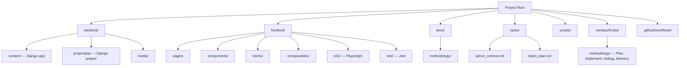

# Directory Structure

```mermaid
flowchart TD
    Root[Project Root]
    Root --> Backend[backend/]
    Root --> Frontend[frontend/]
    Root --> Docs[docs/]
    Root --> Tasks[tasks/]
    Root --> Scripts[scripts/]
    Root --> Windsurf[.windsurf/rules/]
    Root --> GitHub[.github/workflows/]

    Backend --> BContent[content/ — Django app]
    Backend --> BProject[projectapp/ — Django project]
    Backend --> BMedia[media/]

    Frontend --> FPages[pages/]
    Frontend --> FComponents[components/]
    Frontend --> FStores[stores/]
    Frontend --> FComposables[composables/]
    Frontend --> FE2E[e2e/ — Playwright]
    Frontend --> FTest[test/ — Jest]

    Docs --> Methodology[methodology/]
    Tasks --> ActiveCtx[active_context.md]
    Tasks --> TasksPlan[tasks_plan.md]

    Windsurf --> WMethodology[methodology/ — Plan, Implement, Debug, Memory]
```