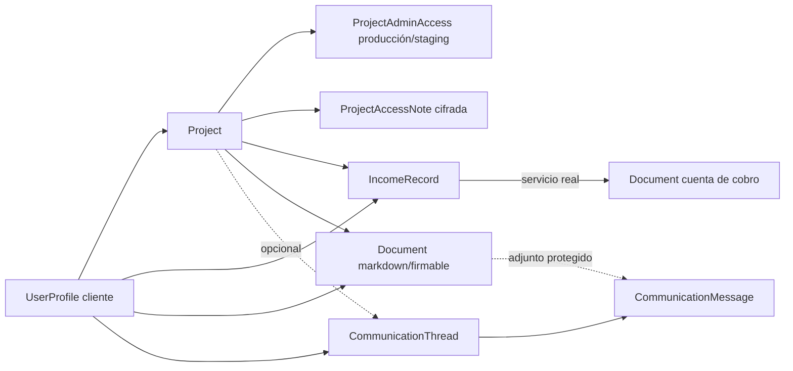

# Cobertura de datos de prueba — ProjectApp

Este documento es el contrato operativo de los datos simulados. El objetivo no
es tener registros decorativos, sino un ambiente de desarrollo que permita
probar paginación, filtros, totales, relaciones, fechas y casos extremos antes
de publicar.

## Comando canónico

```bash
cd backend
python manage.py create_fake_data \
  --settings=projectapp.settings_dev \
  --replace \
  --count 60 \
  --seed 20260826 \
  --anchor-date 2026-08-26
```

La salida imprime el comando de reproducción exacto. `--count 60` es el perfil
representativo; el alias posicional (`create_fake_data 60`) se conserva para la
skill `fake-data-refresh`.

- `--seed` controla cada secuencia aleatoria por módulo. Cada seeder recibe un
  stream independiente, así que agregar consumo aleatorio en Blog no altera
  Documentos o Comunicaciones. También deriva los UUID públicos de propuestas,
  diagnósticos, documentos, share links, Linktrees, QR y entregas de correo.
- `--anchor-date` fija el reloj de negocio. Debe incluirse al reproducir un caso
  en otra máquina; todas las fechas pasadas, vigentes y futuras se calculan a
  partir de ella.
- `--replace` elimina el dataset de desarrollo antes de recrearlo. Sin ese flag,
  el orquestador se niega a acumular otro grafo si encuentra datos simulados o
  raíces de negocio existentes.
- `--skip-accounting` requiere `--skip-documents`: las cuentas de cobro se crean
  desde ingresos reales del dataset y nunca pueden quedar sin entidad de origen.
- Toda la ejecución está dentro de una sola transacción. Si un seeder falla, no
  queda un ambiente parcialmente poblado y `manage.py` termina con código no
  cero.

## Aislamiento y credenciales

Cada comando de fake data, incluido `delete_fake_data`, llama por sí mismo al
guard compartido. Sólo se ejecuta cuando el settings module declara literalmente
`FAKE_DATA_ALLOWED = True`.

- `projectapp.settings_dev`: habilitado y forzado a SQLite.
- `projectapp.settings` y `projectapp.settings_prod`: deshabilitado.
- Producción no puede habilitarlo por `DEBUG`, `DJANGO_ENV`, nombre del host ni
  una convención de nombre de base de datos.
- Pytest habilita la capacidad explícitamente sobre su base aislada de test.

No se crean contraseñas conocidas para cuentas de usuario. Los usuarios demo
reciben contraseña inutilizable salvo que el operador suministre
`SEED_ADMIN_PASSWORD`, `SEED_CLIENT_PASSWORD` o `DEMO_CLIENT_PASSWORD` de forma
explícita. El detalle de cada proyecto sí recibe credenciales operativas
marcadas `demo-only`, cifradas con `PROJECT_ACCESS_CIPHER_KEY` y ligadas sólo a
hosts reservados `.example.test`; sirven para probar reveal/copy sin parecer
secretos reales.

`delete_fake_data --confirm` es un reset de desarrollo: elimina contenido,
proyectos y usuarios no staff. Preserva cuentas staff/superuser, catálogos y
filas contables importadas o manuales; sólo borra contabilidad marcada con
`source_ref="fake:accounting"`.

## Perfil representativo por defecto

Los valores son objetivos mínimos o perfiles deliberados, no repartos uniformes.

| Módulo / entidad raíz | Objetivo con `--count 60` | Distribución relevante |
|---|---:|---|
| Clientes | 60 | 30 sin proyecto, 20 con uno, 9 con tres y 1 con veinte |
| Proyectos | 67 | los siete significados reales: desarrollo, activo, evolución en producción, pausa, suspensión, cierre correcto y baja definitiva; cubren los seis efectos operativos sin estados nulos ni revisión pendiente |
| Accesos de proyecto | 134 ambientes + 134 notas | producción y staging por cada proyecto; URL/admin/usuario/password cifrada, una nota ordinaria y una sensible con contenido cifrado |
| Requerimientos del proyecto de carga | 60 | todos los estados Kanban y prioridades |
| Entregables del proyecto de carga | 60 | seis categorías, versiones y archivados |
| Solicitudes de cambio del proyecto de carga | 60 | seis estados, urgentes/no urgentes y costos grandes |
| Bugs del proyecto de carga | 60 | ocho estados, cuatro severidades y tres ambientes |
| Notificaciones | 60 | seis tipos y mezcla leídas/no leídas |
| Contactos | 60 | contenido Faker determinista |
| Propuestas | ≥60 | todos los estados, clientes reales y una propuesta de título extremo |
| Blog | 60 | publicadas/borrador, categorías, JSON y fechas escalonadas |
| Portafolio | 60 | bilingüe y mezcla publicado/borrador |
| Tareas | 60 | tableros, prioridades, estados, alertas y comentarios |
| Diagnósticos | 61 | 60 del listado + un caso histórico convertido a propuesta |
| Ingresos esperados/perdidos | 63 raíces | esperados, líquidos, perdidos; pendientes, parciales y pagados; candidatos de cobro verdes, naranjas, rojos y sin clasificar |
| Gastos | 60 | personales/negocio y fechas pasadas, actuales y futuras |
| Hosting contable | 45 | 0–4 ciclos, vencidos, vigentes y futuros |
| Documentos | ≥60 | todos con cliente/proyecto; con y sin carpeta; 2 firmables |
| Cuentas de cobro | 40 | creadas desde `IncomeRecord` por el servicio real; draft sin carpeta y issued/paid/overdue/cancelled bajo la jerarquía automática por proyecto, año y mes |
| Hilos de comunicación | 60 | 12 de 1 mensaje, 36 de 3 y 12 de 12; 264 mensajes |
| Preferencias de comunicaciones | 1 por admin demo | navegación por clientes, orden alfabético, 50 hilos, correo y ancho no predeterminados |
| Linktrees / botones | 12 / 48 | activos/inactivos, personal/empresa |
| Tarjetas QR | 30 | URL/Linktree, activas/inactivas y nombre extremo |
| Publicaciones LinkedIn | 20 | draft/scheduled/published/failed |
| Historial de correo | ≥60 | estados de entrega, clientes y fechas escalonadas |
| Historial MCP | 60 | conectores demo inactivos, eventos exitosos/fallidos, sin credenciales reales |

Los catálogos (`DocumentType`, estados, plantillas, defaults, paquetes de horas,
settings singleton) se aseguran o se reutilizan; no se inflan artificialmente a
60 porque su cardinalidad pertenece al dominio.

## Integridad entre módulos



- Todo ingreso tiene cliente; cuando lleva proyecto, ese proyecto pertenece al
  mismo cliente.
- Todo proyecto del dataset tiene exactamente los dos ambientes de acceso y dos
  notas representativas. Passwords y contenidos se guardan como Fernet, nunca
  como los valores demo en claro.
- Toda cuenta de cobro tiene `income_record` de origen y hereda su cliente y
  proyecto. La creación usa `create_income_collection_account`, no escritura
  paralela por ORM.
- Todo documento del generador representativo tiene cliente y proyecto. La mitad
  de cada familia queda sin carpeta para probar ambos filtros.
- Todo hilo tiene cliente. El proyecto y los documentos adjuntos sólo se eligen
  dentro de ese mismo cliente.
- Hosting, ciclos y totales conservan sus equivalencias; abonos parciales y el
  abono compartido mantienen la suma de hijos contra su movimiento de bolsillo.

## Casos extremos intencionales

- nombres de cliente, proyecto, propuesta, documento, hilo y QR largos sin
  espacios;
- montos cercanos al máximo representable;
- un cliente con veinte proyectos y un tercio de los hilos;
- hilos de un mensaje y conversaciones de doce mensajes, con replies, draft,
  failed, corrección de fecha, anulación y cierre;
- documentos con/sin carpeta, firmados/sin firmar y cuentas en todos los estados;
- fechas vencidas, vigentes y futuras en ingresos, gastos, hosting, proyectos,
  comunicaciones y publicaciones programadas.

## Cobertura de modelos y mantenimiento

`content.fake_data` clasifica cada modelo concreto de `accounts` y `content` en
una de cuatro categorías:

- `SEEDED_MODELS`: raíz creada o asegurada por un seeder;
- `DERIVED_MODELS`: filas creadas a través de la raíz o de servicios reales;
- `CATALOG_MODELS`: catálogo de cardinalidad fija, asegurado por migración o
  configuración;
- `EXEMPT_MODELS`: datos que no deben simularse, actualmente OTP y token OAuth.

El test `test_model_contract_classifies_every_concrete_business_model` compara
esa clasificación con el app registry de Django. Un modelo nuevo deja el test en
rojo hasta que la misma entrega:

1. defina su volumen o justifique que es derivado/catálogo/exento;
2. agregue datos coherentes al seeder responsable;
3. añada una aserción observable de relaciones/distribución cuando corresponda;
4. actualice esta matriz si introduce una entidad visible.

La regla es parte de Definition of Done: un modelo visible nuevo sin datos de
prueba no está completo.

## Verificación ejecutable

El contrato focal vive en
`backend/content/tests/management/test_fake_data_contract.py`. Sus 26 casos
comprueban el guard positivo, el inventario de modelos, el replay de semilla,
los volúmenes y sesgos, la integridad cliente/proyecto/origen, las distribuciones
temporales y de comunicaciones, el rollback atómico y el reemplazo completo.
Debe ejecutarse en lotes de máximo 20 tests, de acuerdo con la política del
repositorio; un cambio de seeder no se considera completo si este contrato queda
rojo o si el gate de calidad lo clasifica como no mergeable.

## Comandos parciales

Todos aceptan `--seed` y `--anchor-date` y aplican el mismo guard de entorno.

| Área | Comando responsable |
|---|---|
| Clientes/proyectos extremos | `create_fake_clients_projects` |
| Plataforma base | `seed_platform_data` |
| Volumen y derivados de plataforma | `enrich_platform_data` |
| Clientes de estados especiales | `seed_demo_clients` |
| Propuestas / paquetes | `create_fake_proposals`, `create_fake_hour_packages` |
| Blog / portafolio / tareas / diagnósticos | `create_fake_blog_posts`, `create_fake_portfolio`, `create_fake_tasks`, `create_fake_diagnostics` |
| Contabilidad / hosting | `create_fake_accounting` |
| Documentos / cuentas de cobro | `create_fake_documents` |
| Comunicaciones | `create_fake_communications` |
| Email / QR / Linktree / LinkedIn / MCP | `create_fake_auxiliary` |
| Limpieza | `delete_fake_data --confirm` |
