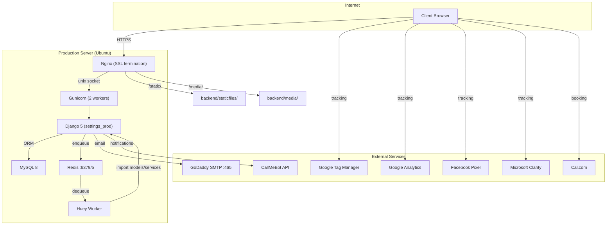
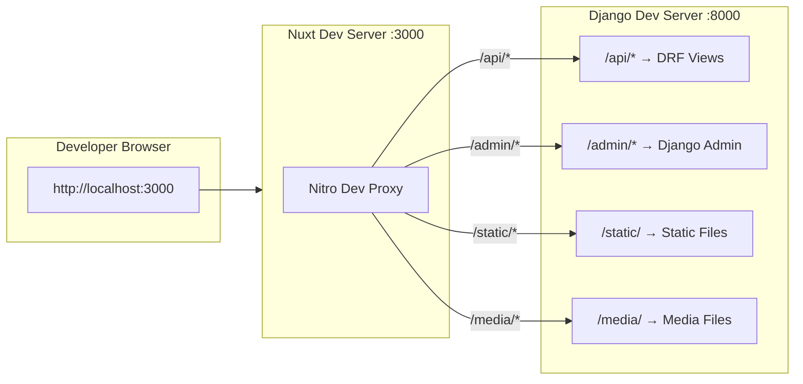
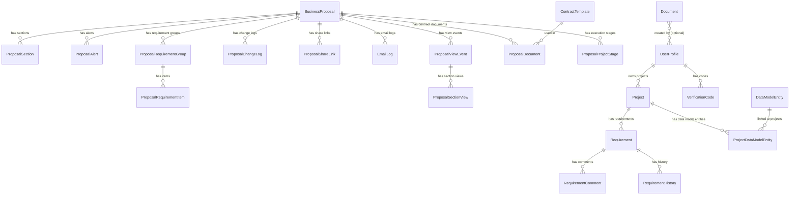
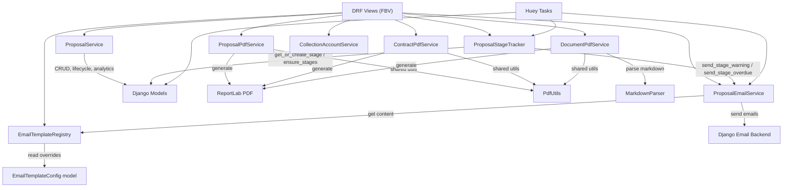
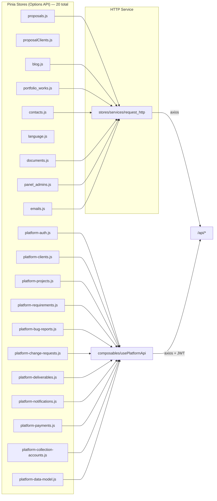
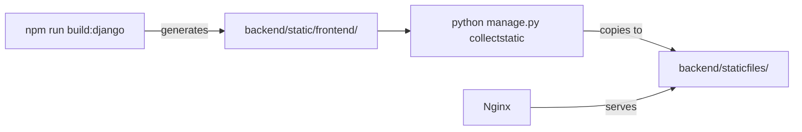

```mermaid
flowchart TD
    ProposalPage["pages/proposal/[uuid].vue"]
    ProposalPage --> ProposalStore
    ProposalPage --> useProposalNavigation
    ProposalPage --> useExpirationTimer
    ProposalPage --> useProposalTracking
    ProposalPage --> useSectionAnimations
    ProposalPage --> GSAP["GSAP ScrollTrigger (horizontal scroll)"]

    ProposalPage --> Sections["12 Section Components"]
    Sections --> Greeting
    Sections --> ExecutiveSummary
    Sections --> ContextDiagnostic
    Sections --> ConversionStrategy
    Sections --> DesignUX
    Sections --> CreativeSupport
    Sections --> DevelopmentStages
    Sections --> FunctionalRequirements
    Sections --> Timeline
    Sections --> Investment
    Sections --> FinalNote
    Sections --> NextSteps

    ProposalPage --> Overlays["Overlay Components"]
    Overlays --> ProposalIndex
    Overlays --> SectionCounter
    Overlays --> ExpirationBadge
    Overlays --> PdfDownloadButton
    Overlays --> ShareProposalButton
    Overlays --> ProposalExpired
```

# Architecture — ProjectApp

## 1. System Overview



---

## 2. Development Architecture



---

## 3. Request Flow


---

## 4. Data Model

### 4.1 Model Inventory



### 4.2 Model Details

| Model | Purpose | Key Fields |
|-------|---------|------------|
| **BusinessProposal** | Core proposal entity | uuid, title, **client (FK→accounts.UserProfile, PROTECT)**, client_name (snapshot), client_email (snapshot), client_phone (snapshot), status, total_investment, currency, language, expires_at, view_count, cached_heat_score. Snapshots are write-through, kept in sync via `proposal_client_service.sync_snapshot()`. |
| **ProposalSection** | Individual section within a proposal | proposal_fk, section_type (12 types), title, order, is_enabled, content_json, is_wide_panel |
| **ProposalRequirementGroup** | Functional requirements group | proposal_fk, group_id, title, description, order |
| **ProposalRequirementItem** | Individual requirement item | group_fk, name, description, icon |
| **ProposalAlert** | Manual/auto alerts for sellers | proposal_fk, alert_type (12 types), message, alert_date, priority, is_dismissed |
| **ProposalViewEvent** | Each client page-load | proposal_fk, session_id, ip_address, user_agent, view_mode |
| **ProposalSectionView** | Per-section time tracking | view_event_fk, section_type, time_spent_seconds, entered_at, view_mode |
| **ProposalChangeLog** | Full audit trail | proposal_fk, change_type (20 types), field_name, old_value, new_value |
| **ProposalShareLink** | Multi-stakeholder sharing | proposal_fk, uuid, shared_by_name, recipient_name, view_count |
| **ProposalDefaultConfig** | Default section templates per language | language (unique), sections_json |
| **ProposalProjectStage** | Internal project execution tracking (Cronograma) — internal-only, gated by `is_admin` in serializer | proposal_fk, stage_key (`design`/`development`), order, start_date, end_date, completed_at, warning_sent_at, last_overdue_reminder_at |
| **EmailTemplateConfig** | Admin-editable email content | template_key (unique), content_overrides, is_active |
| **EmailLog** | Email deliverability tracking + composed email history | proposal_fk, template_key, recipient, status, error_message, metadata (JSONField) |
| **Contact** | Contact form submissions | email, phone_number, subject, message, budget |
| **PortfolioWork** | Portfolio case studies | title_en/es, slug, cover_image, project_url, content_json_en/es, SEO fields |
| **BlogPost** | Blog articles | title_en/es, slug, cover_image, excerpt, content_json/html, category, author, SEO fields |
| **Document** | Generic branded PDF document | uuid, title, slug, status (draft/published/archived), language (es/en), cover_type (generic/none/proposal), content_json, created_at |
| **ContractTemplate** | Reusable contract template | title, sections_json, parameters_json, created_at |
| **ProposalDocument** | Links a proposal to a generated contract | proposal_fk, contract_template_fk, title, pdf_file, is_draft, signed_at, contractor_signature |
| **CompanySettings** | Company-level branding and info used in PDFs | name, logo, address, tax_id, email, phone, website |
| **UserProfile** | Platform user (extends Django User) | user_fk, role (admin/client), company_name, phone, avatar, onboarding_completed, is_active |
| **VerificationCode** | OTP codes for login | user_fk, code, expires_at, is_used |
| **Project** | Client projects in platform | owner_fk, title, description, status (active/completed/archived), created_at |
| **Requirement** | Kanban board items | project_fk, title, description, status (backlog/in_progress/done), priority, assignee, order |
| **RequirementComment** | Comments on requirements | requirement_fk, author_fk, text, created_at |
| **RequirementHistory** | Audit trail for requirements | requirement_fk, field_name, old_value, new_value, changed_by |
| **BugReport** | Bug reports per project | project_fk, title, description, status, priority, reported_by |
| **ChangeRequest** | Change requests per project | project_fk, title, description, status, requested_by |
| **Deliverable** | Project deliverables tracking | project_fk, title, description, status, due_date |
| **Notification** | In-platform notifications | user_fk, message, type, is_read, created_at |
| **Payment** | Payment milestones per project | project_fk, title, amount, status, due_date |
| **DataModelEntity** | Reusable JSON-defined data model schema | name, description, schema_json, created_at |
| **ProjectDataModelEntity** | Links a data model entity to a project | project_fk, data_model_entity_fk, custom_schema_json |

---

## 5. Service Layer



### Service Responsibilities

| Service | File Size | Responsibilities |
|---------|-----------|-----------------|
| **ProposalService** | 132K | Proposal CRUD, section management, default sections, analytics computation, engagement scoring, dashboard aggregation, CSV export, scorecard |
| **ProposalEmailService** | ~73K | All email sending: proposal sent, reminders, urgency, abandonment, revisit alerts, stakeholder alerts, engagement decay, post-expiration, branded + proposal composed emails, stage warning + stage overdue (via shared `_send_stage_notification` helper) |
| **ProposalStageTracker** | ~9K | Day-by-day decision logic for project-stage email notifications. Holds the canonical `STAGE_DEFINITIONS` catalog (`design`, `development`), `ensure_stages` / `get_or_create_stage` helpers, `format_remaining_time(days)` (`"hoy"`, `"1 día"`, `"1 semana 5 días"`), and `process(proposal)` decision tree (70%-elapsed warning + every-3-days overdue reminders). |
| **ProposalPdfService** | 72K | PDF generation with ReportLab: all 12 section types rendered to PDF |
| **ContractPdfService** | 10K | Contract PDF generation with contractor signature block, draft mode (no signature), Helvetica font, clickable TOC |
| **EmailTemplateRegistry** | 44K | Centralized registry of all email templates with default content, admin-editable overrides, preview rendering, branded + proposal composed email entries |
| **PdfUtils** | 47K | Shared PDF rendering utilities (fonts, colors, layout helpers) used by ProposalPdfService, ContractPdfService, and DocumentPdfService |
| **DocumentPdfService** | 20K | PDF generation for generic branded Documents with template-based rendering |
| **MarkdownParser** | 9K | Parses markdown content for Document PDF rendering |
| **CollectionAccountService** | 6K | Collection account business logic |
| **CollectionAccountPdfService** | 7K | PDF generation for collection account documents |
| **TechnicalDocumentPdf** | 17K | PDF generation for technical documents |
| **TechnicalDocumentFilter** | 3K | Filtering logic for technical document modules |
| **PlatformOnboardingPdf** | 5K | PDF generation for platform onboarding documents |

---

## 6. Frontend Architecture

### 6.1 Page Routing

```mermaid
flowchart TD
    subgraph Public["Public Pages (SSR)"]
        Home["/"]
        Landing1["/landing-web-design"]
        Landing2["/landing-software"]
        Landing3["/landing-apps"]
        About["/about-us"]
        Portfolio["/portfolio-works"]
        PortfolioDetail["/portfolio-works/:slug"]
        Blog["/blog"]
        BlogDetail["/blog/:slug"]
        Contact["/contact"]
        ContactSuccess["/contact-success"]
    end

    subgraph SPA["SPA Pages"]
        Proposal["/proposal/:uuid"]
        Panel["/panel/ (Dashboard)"]
        PanelLogin["/panel/login"]
        ProposalsList["/panel/proposals"]
        ProposalCreate["/panel/proposals/create"]
        ProposalEdit["/panel/proposals/:id/edit (tabs: General, Correos, Documentos, Cronograma, Secciones, Det. técnico, Prompt, JSON, Actividad, Analytics)"]
        ProposalDefaults["/panel/proposals/defaults"]
        EmailTemplates["/panel/proposals/email-templates"]
        EmailDeliverability["/panel/proposals/email-deliverability"]
        BlogAdmin["/panel/blog"]
        BlogCreate["/panel/blog/create"]
        BlogEdit["/panel/blog/:id/edit"]
        BlogCalendar["/panel/blog/calendar"]
        PortfolioAdmin["/panel/portfolio"]
        PortfolioCreate["/panel/portfolio/create"]
        PortfolioEdit["/panel/portfolio/:id/edit"]
        Clients["/panel/clients"]
        Admins["/panel/admins"]
        DocumentsAdmin["/panel/documents"]
        DocumentCreate["/panel/documents/create"]
        DocumentEdit["/panel/documents/:id/edit"]
        EmailsPage["/panel/emails"]
        ViewsPage["/panel/views"]
    end

    subgraph Platform["Platform Pages (JWT Auth)"]
        PlatformLogin["/platform/login"]
        PlatformVerify["/platform/verify"]
        PlatformProfile["/platform/complete-profile"]
        PlatformDashboard["/platform/dashboard"]
        PlatformBoard["/platform/board"]
        PlatformProjects["/platform/projects"]
        PlatformProjectDetail["/platform/projects/:id"]
        PlatformProjectBoard["/platform/projects/:id/board"]
        PlatformProjectBugs["/platform/projects/:id/bugs"]
        PlatformProjectChanges["/platform/projects/:id/changes"]
        PlatformProjectDeliverables["/platform/projects/:id/deliverables"]
        PlatformProjectPayments["/platform/projects/:id/payments"]
        PlatformClients["/platform/clients"]
        PlatformClientDetail["/platform/clients/:id"]
        PlatformBugs["/platform/bugs"]
        PlatformChanges["/platform/changes"]
        PlatformDeliverables["/platform/deliverables"]
        PlatformNotifications["/platform/notifications"]
        PlatformPayments["/platform/payments"]
        PlatformCollectionAccountsPage["/platform/collection-accounts"]
        PlatformCollectionAccountDetail["/platform/collection-accounts/:id"]
        PlatformProjectCollectionAccounts["/platform/projects/:id/collection-accounts"]
        PlatformProjectDataModel["/platform/projects/:id/data-model"]
        PlatformDeliverableDetail["/platform/projects/:id/deliverables/:did"]
        PlatformProfilePage["/platform/profile"]
    end

    Panel -->|middleware: admin-auth| AuthCheck["/api/auth/check/"]
    PlatformDashboard -->|middleware: platform-auth| JWTCheck["JWT validation"]
```



### 6.2 Store Architecture



### 6.3 Proposal Admin List — Filters & Tabs

```mermaid
flowchart TD
    ProposalsList["pages/panel/proposals/index.vue"]
    ProposalsList --> ProposalStore["proposals.js (Pinia)"]
    ProposalsList --> useProposalFilters["useProposalFilters.js"]

    useProposalFilters --> FilterState["reactive currentFilters (11 dimensions)"]
    useProposalFilters --> TabState["savedTabs (localStorage + URL sync)"]
    useProposalFilters --> ApplyFilters["applyFilters() — single-pass client-side"]

    ProposalsList --> FilterTabs["ProposalFilterTabs.vue"]
    FilterTabs --> TabBar["Tab bar: Todas + saved tabs + '+' button"]
    FilterTabs --> TabActions["Rename / Delete context menu"]

    ProposalsList --> FilterPanel["ProposalFilterPanel.vue"]
    FilterPanel --> StatusPills["Status multi-select pills"]
    FilterPanel --> Dropdowns["Project type / Market type dropdowns"]
    FilterPanel --> Ranges["Investment / Heat score / View count ranges"]
    FilterPanel --> Dates["Created / Last activity date ranges"]
    FilterPanel --> Toggles["Currency / Language / Active status toggles"]
```



### 6.4 Proposal Client View Architecture



---

## 7. Async Task Architecture

```mermaid
flowchart TD
    subgraph Triggers["Task Triggers"]
        SendAction["Admin: Send Proposal"]
        DailyCron["Daily Cron (midnight)"]
        TrackEndpoint["Client: Track Engagement"]
    end

    subgraph HueyTasks["Huey Tasks"]
        SendReminder["send_proposal_reminder"]
        SendUrgency["send_urgency_reminder"]
        ExpireStale["expire_stale_proposals (periodic)"]
        SendAbandon["send_abandonment_email"]
        SendRevisit["send_revisit_alert"]
        SendInvestment["send_investment_interest_email"]
        SendStakeholder["send_stakeholder_alert"]
        SendPostExpiry["send_post_expiration_alert"]
        SendEngagementDecay["send_engagement_decay_alert"]
        SendCalcFollowup["send_calculator_followup"]
        RefreshHeatScores["refresh_all_heat_scores (periodic)"]
        AutoArchive["auto_archive_stale_proposals (periodic)"]
        StageDeadlines["notify_proposal_stage_deadlines (periodic — daily 13:30 UTC = 08:30 Bogotá)"]
    end

    SendAction -->|schedule delay| SendReminder
    SendAction -->|schedule delay| SendUrgency
    DailyCron --> ExpireStale
    DailyCron --> RefreshHeatScores
    DailyCron --> AutoArchive
    DailyCron --> StageDeadlines
    TrackEndpoint -->|conditional| SendAbandon
    TrackEndpoint -->|conditional| SendRevisit
    TrackEndpoint -->|conditional| SendInvestment
    TrackEndpoint -->|conditional| SendStakeholder
    TrackEndpoint -->|conditional| SendPostExpiry
    TrackEndpoint -->|conditional| SendEngagementDecay
    TrackEndpoint -->|conditional| SendCalcFollowup
    StageDeadlines -->|via ProposalStageTracker.process| HueyTasksOut["send_stage_warning / send_stage_overdue (internal team)"]
```



---

## 8. Deployment Architecture

```
Client (HTTPS)
    │
    ▼
Nginx (SSL termination, Let's Encrypt)
    ├── /static/  → backend/staticfiles/
    ├── /media/   → backend/media/
    └── /*        → unix:/run/projectapp.sock
                        │
                        ▼
                   Gunicorn (2 workers)
                        │
                        ▼
                   Django (settings_prod)
                   ├── /api/*     → DRF views
                   ├── /admin/*   → Django admin
                   └── /*         → serve_nuxt (pre-rendered Nuxt pages)

Systemd Services:
  - projectapp.service  → Gunicorn (via projectapp.socket)
  - projectapp-huey     → Huey worker

Redis:
  - redis://localhost:6379/5  → Huey task queue

MySQL:
  - localhost:3306  → projectapp_db
```

### Production Build Flow



---

## 9. Current Workflow

### Proposal Creation → Client View → Close

1. Admin creates proposal via `/panel/proposals/create` (or JSON import)
2. Admin selects an existing client from `<ClientAutocomplete>` (or types a new one). Backend resolves the client via `proposal_client_service.get_or_create_client_for_proposal()` — case-insensitive dedup by `User.email`, never hijacks admin accounts. Empty emails get a placeholder `cliente_<id>@temp.example.com` (RFC 2606 reserved TLD) generated via two-step save, which automatically pauses every email automation for that proposal until a real address is entered.
3. 12 sections auto-generated with default content per language
4. Admin edits sections via `/panel/proposals/{id}/edit` (client picker also available there; can be swapped or its profile updated via the propagate-changes checkbox which cascades the snapshot to every other linked proposal)
5. Admin clicks "Send" → email sent to client + admin notification + reminders scheduled (skipped silently if client email is a placeholder)
6. Client opens unique link `/proposal/{uuid}`
7. Frontend loads GSAP horizontal-scroll experience with all enabled sections
8. Engagement tracked: view events, section time, session ID
9. Automated emails triggered based on behavior (reminder, urgency, abandonment, etc.) — every client-facing send checks `_is_unsendable_client_email()` first, so placeholder accounts never receive mail
10. Client responds: accept / reject (with reason) / negotiate / comment. Acceptance fires `ProposalEmailService.send_acceptance_confirmation()` to the client (this branch was added 2026-04-09 — see ERR-007).
11. Admin monitors via dashboard, alerts, analytics, scorecard. Orphan clients (zero proposals, zero projects) can be cleaned up from `/panel/clients` Huérfanos tab.