# Architecture — ProjectApp

## 1. System Overview

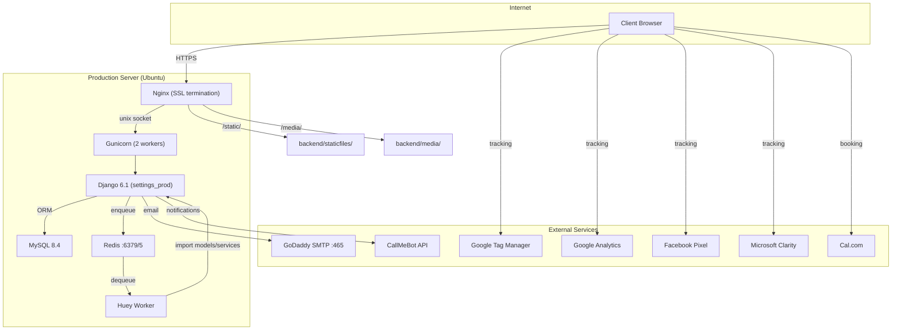
```mermaid
flowchart TB
    subgraph Internet
        Client[Client Browser]
    end

    subgraph Production["Production Server (Ubuntu)"]
        Nginx["Nginx (SSL termination)"]
        Gunicorn["Gunicorn (2 workers)"]
        Django["Django 6.1 (settings_prod)"]
        Redis["Redis :6379/5"]
        Huey["Huey Worker"]
        MySQL["MySQL 8.4"]

        Nginx -->|unix socket| Gunicorn
        Gunicorn --> Django
        Django -->|ORM| MySQL
        Django -->|enqueue| Redis
        Redis -->|dequeue| Huey
        Huey -->|import models/services| Django
    end

    Client -->|HTTPS| Nginx
    Nginx -->|/static/| StaticFiles["backend/staticfiles/"]
    Nginx -->|/media/| MediaFiles["backend/media/"]

    subgraph ExternalServices["External Services"]
        SMTP["GoDaddy SMTP :465"]
        WhatsApp["CallMeBot API"]
        GTM["Google Tag Manager"]
        GA["Google Analytics"]
        FB["Facebook Pixel"]
        Clarity["Microsoft Clarity"]
        Cal["Cal.com"]
    end

    Django -->|email| SMTP
    Django -->|notifications| WhatsApp
    Client -->|tracking| GTM
    Client -->|tracking| GA
    Client -->|tracking| FB
    Client -->|tracking| Clarity
    Client -->|booking| Cal
```

---

## 2. Development Architecture

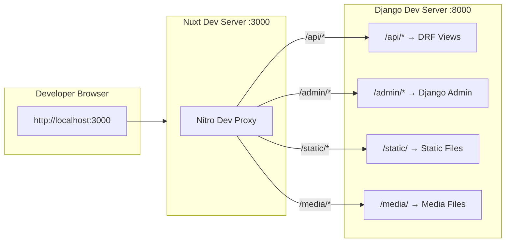
```mermaid
flowchart LR
    subgraph DevBrowser["Developer Browser"]
        NuxtDev["http://localhost:3000"]
    end

    subgraph NuxtServer["Nuxt Dev Server :3000"]
        NitroProxy["Nitro Dev Proxy"]
    end

    subgraph DjangoServer["Django Dev Server :8000"]
        DjAPI["/api/* → DRF Views"]
        DjAdmin["/admin/* → Django Admin"]
        DjStatic["/static/ → Static Files"]
        DjMedia["/media/ → Media Files"]
    end

    NuxtDev --> NuxtServer
    NitroProxy -->|/api/*| DjAPI
    NitroProxy -->|/admin/*| DjAdmin
    NitroProxy -->|/static/*| DjStatic
    NitroProxy -->|/media/*| DjMedia
```

---

## 3. Request Flow

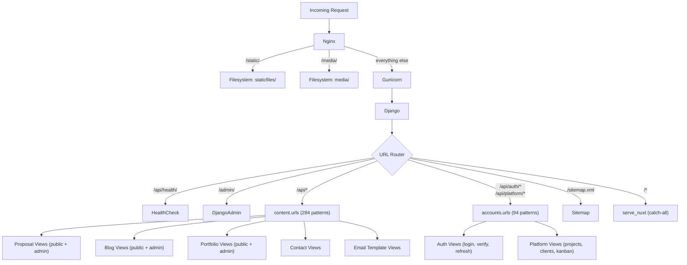
```mermaid
flowchart TD
    Request[Incoming Request] --> Nginx

    Nginx -->|/static/| FS1[Filesystem: staticfiles/]
    Nginx -->|/media/| FS2[Filesystem: media/]
    Nginx -->|everything else| Gunicorn

    Gunicorn --> Django
    Django --> URLRouter{URL Router}

    URLRouter -->|/api/health/| HealthCheck
    URLRouter -->|/admin/| DjangoAdmin

    URLRouter -->|/api/*| ContentURLs["content.urls (284 patterns)"]
    URLRouter -->|/api/auth/*<br>/api/platform/*| AccountsURLs["accounts.urls (94 patterns)"]
    URLRouter -->|/sitemap.xml| Sitemap
    URLRouter -->|/*| ServeNuxt["serve_nuxt (catch-all)"]

    AccountsURLs --> AuthViews["Auth Views (login, verify, refresh)"]
    AccountsURLs --> PlatformViews["Platform Views (projects, clients, kanban)"]

    ContentURLs --> ProposalViews["Proposal Views (public + admin)"]
    ContentURLs --> BlogViews["Blog Views (public + admin)"]
    ContentURLs --> PortfolioViews["Portfolio Views (public + admin)"]
    ContentURLs --> ContactViews["Contact Views"]
    ContentURLs --> EmailTemplateViews["Email Template Views"]
```

### Documents list-detail navigation

The Documents list owns its navigation state in the route query. Filters, global
search, normal/archived scope, list/grid mode and pagination are therefore
shareable and restorable browser history entries rather than component memory.
Opening an editor copies the complete localized list route into `from` and adds the
document id as `focus` for the explicit return path.

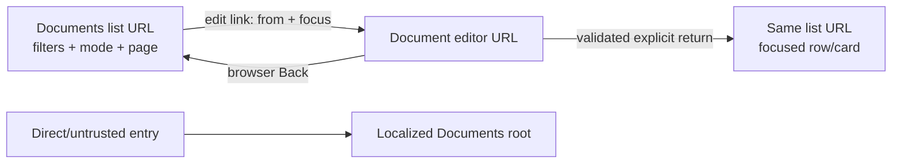
```mermaid
flowchart LR
    List["Documents list URL\nfilters + mode + page"] -->|"edit link: from + focus"| Editor[Document editor URL]
    Editor -->|"validated explicit return"| Focused["Same list URL\nfocused row/card"]
    Editor -->|"browser Back"| List
    Direct[Direct/untrusted entry] --> Root[Localized Documents root]
```

`frontend/utils/documentReturnNavigation.js` accepts only same-application routes
whose localized path resolves to `/panel/documents`; it rejects protocol-relative,
external and cross-module destinations. `useDocumentFilterQuery` owns bidirectional
route/state synchronization. This flow is frontend-only and does not change the
Documents API or schema.

### MCP ingress and throttling

Remote MCP connectors enter through `/api/mcp/<slug>/<token>/`. Django validates the capability token, connector active state and allowed Origin before dispatching JSON-RPC tools. Anonymous throttling is isolated by `client IP + registered connector slug`; concurrent startup traffic for one connector therefore cannot exhaust another connector's quota. Any unregistered slug maps to the shared `unknown` bucket so callers cannot evade throttling by manufacturing paths.

`TOOLS_BY_SLUG` dispatches nine module catalogs: blog, documents, proposals,
diagnostics, clients, tasks, accounting, LinkedIn personal and communications.
The Communications catalog is deliberately five-tool: list/open a thread,
create a thread, append a message and mark an outgoing draft as sent. Its writes
delegate to `communication_service.py`, so client ownership, project scope,
direction/channel/status transitions, reply linkage and protected Document
references are identical to the panel. It records a confirmed send; provider
delivery remains outside this phase.

MCP parity is an architectural boundary, not informal documentation.
`content/mcp/contracts.py` classifies every concrete field of every exposed model
as read-only, read-write or intentionally excluded with a reason. Contract tests
reject an unclassified/stale field and validate unique snake-case tool names,
descriptions and object schemas. The repeatable manual/API matrix lives in
`docs/MCP_VALIDATION_RUNBOOK.md`.

The Documents connector treats client delivery copy and observations as private
document metadata. `client_email_subject`, `client_email_body`,
`client_whatsapp_message`, and the ordered legacy `client_custom_notes` array travel
beside the report markdown, not inside it. `client-report` creates one canonical
message triple and passes it to `create_document`/`update_document`; an enclosing
`client-message` run returns those same values. Normalized `DocumentNote` rows may be
opened and resolved through the admin or Documents MCP, including their optional link
to a needs-fix episode. The admin edit modal persists the four communication fields
with a notes-only partial update and advances only their unsaved-change baseline;
normalized observations use their own audited workflow endpoints. The create modal
applies communication notes to the draft until the document exists. The PDF renderer,
list serializers, and platform serializers expose none of this private metadata.

---

## 4. Data Model

### 4.1 Model Inventory


```mermaid
erDiagram
    BusinessProposal ||--o{ ProposalSection : "has sections"
    BusinessProposal ||--o{ ProposalAlert : "has alerts"
    BusinessProposal ||--o{ ProposalViewEvent : "has view events"
    BusinessProposal ||--o{ ProposalChangeLog : "has change logs"
    BusinessProposal ||--o{ ProposalShareLink : "has share links"
    BusinessProposal ||--o{ EmailLog : "has email logs"
    BusinessProposal ||--o{ ProposalRequirementGroup : "has requirement groups"
    BusinessProposal ||--o{ ProposalDocument : "has contract documents"
    BusinessProposal ||--o{ ProposalProjectStage : "has execution stages"
    ProposalRequirementGroup ||--o{ ProposalRequirementItem : "has items"
    ProposalViewEvent ||--o{ ProposalSectionView : "has section views"
    Document }o--o{ UserProfile : "created by (optional)"
    Document ||--o{ DocumentStateEpisode : "has workflow episodes"
    DocumentStateGroup ||--o{ DocumentState : "groups catalog states"
    DocumentState ||--o{ DocumentStateEpisode : "occurs as"
    DocumentStateEpisode ||--o{ DocumentStateEpisodeEvent : "records immutable events"
    Project ||--o{ DocumentStateEpisode : "has lifecycle episodes"
    DocumentState ||--o{ Project : "is current lifecycle state"
    Document ||--o{ DocumentNote : "has observations"
    DocumentStateEpisode ||--o{ DocumentNote : "may originate"
    ContractTemplate ||--o{ ProposalDocument : "used in"

    UserProfile ||--o{ CommunicationThread : "owns conversations"
    Project o|--o{ CommunicationThread : "scopes optionally"
    CommunicationThread ||--o{ CommunicationMessage : "orders messages"
    CommunicationMessage o|--o{ CommunicationMessage : "replies to"
    CommunicationMessage ||--o{ CommunicationAttachment : "references"
    Document ||--o{ CommunicationAttachment : "is used in"
    CommunicationMessage ||--o{ CommunicationMessageDateCorrection : "audits dates"

    UserProfile ||--o{ Project : "owns projects"
    UserProfile ||--o{ VerificationCode : "has codes"
    UserProfile ||--o{ Document : "signs (optional)"
    Project ||--o{ ProjectPhase : "has phases"
    ProjectPhase ||--o{ ProjectScopeItem : "has scope items"
    ProjectScopeItem ||--o{ Requirement : "groups requirements"
    Project ||--o{ Requirement : "has requirements"
    Project ||--o{ ProjectDataModelEntity : "has data model entities"
    Requirement ||--o{ RequirementComment : "has comments"
    Requirement ||--o{ RequirementHistory : "has history"
    DataModelEntity ||--o{ ProjectDataModelEntity : "linked to projects"
    WebAppDiagnostic ||--o{ DiagnosticSection : "has sections"
    McpConnector ||--o{ McpRequestLog : "has activity"
```

### 4.2 Model Details

| Model | Purpose | Key Fields |
|-------|---------|------------|
| **BusinessProposal** | Core proposal entity | uuid, title, **client (FK→accounts.UserProfile, PROTECT)**, client_name (snapshot), client_email (snapshot), client_phone (snapshot), status, total_investment, currency, language, show_contract_terms, expires_at, view_count, cached_heat_score. Snapshots are write-through, kept in sync via `proposal_client_service.sync_snapshot()`. |
| **ProposalSection** | Individual section within a proposal | proposal_fk, section_type (18 types — incl. `roi_projection`, web-only), title, order, is_enabled, content_json, is_wide_panel |
| **ProposalRequirementGroup** | Functional requirements group | proposal_fk, group_id, title, description, order |
| **ProposalRequirementItem** | Individual requirement item | group_fk, name, description, icon |
| **ProposalAlert** | Manual/auto alerts for sellers | proposal_fk, alert_type (12 types), message, alert_date, priority, is_dismissed |
| **ProposalViewEvent** | Each client page-load | proposal_fk, session_id, ip_address, user_agent, view_mode (`executive`/`detailed`/`technical`/`legal`) |
| **ProposalSectionView** | Per-section time tracking | view_event_fk, section_type, subsection_key (technical fragment or legal clause), time_spent_seconds, entered_at, view_mode |
| **ProposalChangeLog** | Full audit trail | proposal_fk, change_type (20 types), field_name, old_value, new_value |
| **ProposalShareLink** | Multi-stakeholder sharing | proposal_fk, uuid, shared_by_name, recipient_name, view_count |
| **ProposalDefaultConfig** | Default section templates per language | language (unique), sections_json |
| **DiagnosticDefaultConfig** | Per-language defaults applied at `WebAppDiagnostic` creation | language (unique), sections_json, payment_initial_pct (60), payment_final_pct (40), default_currency, default_investment_amount, default_duration_label, expiration_days, reminder_days, urgency_reminder_days. `clean()` enforces payment sum = 100. Read by `diagnostic_service.create_diagnostic` and surfaced through `/api/diagnostics/defaults/`. |
| **ProposalProjectStage** | Internal project execution tracking (Cronograma) — internal-only, gated by `is_admin` in serializer | proposal_fk, stage_key (`design`/`development`), order, start_date, end_date, completed_at, warning_sent_at, last_overdue_reminder_at |
| **EmailTemplateConfig** | Admin-editable email content | template_key (unique), content_overrides, is_active |
| **EmailLog** | Universal outbound trace + composed email history | proposal_fk, template_key, recipient, audience, status (including skipped), error_message, metadata (JSONField), delivery_id, delivery_role (primary/copy) |
| **EmailCopyRecipient** | Separate administrable BCC audience for every outbound email | email (unique), is_active, families (JSON list), created_at, updated_at |
| **Contact** | Contact form submissions | email, phone_number, subject, message, budget |
| **PortfolioWork** | Portfolio case studies | title_en/es, slug, cover_image, project_url, content_json_en/es, SEO fields |
| **BlogPost** | Blog articles | title_en/es, slug, cover_image, excerpt, content_json/html, category, author, SEO fields |
| **Document** | Generic branded PDF document (also the client signing portal source) | uuid, title, slug, is_client_visible, legacy status (expand/contract only), language (es/en), cover_type, content_json, private delivery copy, **requires_signature, signed_at, signed_by (FK→User), signature_name, signature_ip, signature_user_agent**, client_user/project/deliverable/folder FKs, created_at |
| **DocumentStateGroup / DocumentState** | Shared, scoped workflow catalog for documents and projects | catalog, group name/order/selection_mode; state name/normalized_name/slug/color/order/is_active/system_key/merged_into/incompatibilities/authors plus immutable project `operational_effect`; non-null `system_key` is database-unique per catalog and `NULL` remains repeatable |
| **DocumentStateEpisode / DocumentStateEpisodeEvent** | Canonical document/project workflow and append-only audit | exactly one of document/project, state, opened_at/closed_at, actors, outcome, close_note, origin; each opening/closing/removal/transition/merge/date correction has effective_at, recorded_at, actor and details |
| **DocumentNote** | Private normalized observation optionally linked to its originating episode | document, episode, title, content, order, open/resolved/discarded status, resolution_note, created/resolved actors and timestamps |
| **DocumentFolder / DocumentTag** | Folder hierarchy plus legacy tag compatibility during rollout | name, color, parent (folder), created_by |
| **CommunicationThread** | Client conversation container; separate from Document | client (PROTECT), optional project (SET_NULL), title, open/closed status, last_activity_at, closed_at, created/updated audit actors |
| **CommunicationMessage** | One ordered incoming/outgoing conversation event | thread, channel, direction, status, subject/content, occurred_at/recorded_at, source, reply_to, optional EmailLog seam, void audit |
| **CommunicationAttachment** | Bidirectional reference to an existing document | message (CASCADE), document (PROTECT), unique message/document pair |
| **CommunicationMessageDateCorrection** | Append-only business-date correction | message, previous/corrected occurred_at, reason, corrected_by/at |
| **ContractTemplate** | Reusable contract template | title, sections_json, parameters_json, created_at |
| **ProposalDocument** | Links a proposal to a generated contract | proposal_fk, contract_template_fk, title, pdf_file, is_draft, signed_at, contractor_signature |
| **CompanySettings** | Company-level branding and info used in PDFs | name, logo, address, tax_id, email, phone, website |
| **UserProfile** | Platform user (extends Django User) | user_fk, role (admin/client), company_name, phone, avatar, is_onboarded, profile_completed, **email_verified, email_verified_at**, is_active |
| **VerificationCode** | OTP codes (login + email validation) | user_fk, code, purpose, expires_at, is_used |
| **SavedFilterTab** | Persisted admin filter tabs | user_fk, scope, name, filters_json, order |
| **Project** | Client project in platform with a real lifecycle | client_fk, name, description, current_state FK, state_review_required, compatibility status mirror (development/active/paused/suspended/completed/decommissioned; archived only for legacy review), progress, dates, payment/hosting snapshots and operational URLs/credentials |
| **ProjectPhase** | Execution phase of a project (from an accepted proposal) | project_fk, business_proposal_fk (unique per project), order, hosting_start_date, hosting_activated_at |
| **ProjectScopeItem** | Scope grouping mirrored from proposal FR groups | phase_fk, title, description, kind, order, archived. Chain: Project → ProjectPhase → ProjectScopeItem → Requirement |
| **Requirement** | Kanban board card | project_fk, phase_fk, **scope_item_fk**, title, description, status (backlog/todo/in_progress/in_review), priority, order, deliverable_fk, **content_overridden** |
| **RequirementComment** | Comment on a requirement | requirement_fk, author_fk, text, created_at |
| **RequirementHistory** | Audit trail for requirements | requirement_fk, field_name, old_value, new_value, changed_by |
| **BugReport** | Bug reports per project | project_fk, title, description, status, priority, reported_by |
| **ChangeRequest** | Change requests per project | project_fk, title, description, status, requested_by |
| **Deliverable** | Project deliverables tracking | project_fk, title, description, status, due_date |
| **Notification** | In-platform notifications | user_fk, message, type, is_read, created_at |
| **HostingSubscription** | Hosting billing subscription | project_fk, plan (`quarterly`/`semiannual`/`nine_month`; legacy monthly/annual readable), status, start_date, billing amounts, next_billing_date |
| **Payment** | Payment milestones per project | project_fk, title, amount, status, due_date |
| **PaymentHistory** | Payment audit trail | payment_fk, event_type, amount, notes |
| **DataModelEntity** | Reusable JSON-defined data model schema | name, description, schema_json, created_at |
| **ProjectDataModelEntity** | Links a data model entity to a project | project_fk, data_model_entity_fk, custom_schema_json |
| **WebAppDiagnostic** | App-diagnostic entity (JSON-section architecture, mirrors BusinessProposal) | uuid, title, client snapshots, status, currency, investment, expires_at, view_count |
| **DiagnosticSection** | Section within a diagnostic | diagnostic_fk, section_type (8), content_json, visibility (initial/final/both), order |
| **DiagnosticChangeLog / DiagnosticViewEvent / DiagnosticSectionView** | Diagnostic audit + analytics | mirror the Proposal event/log models |
| **Task / TaskComment / TaskAlert** | Internal admin Kanban board (`/panel/tasks`) | status/priority TextChoices, position, assignee FK, due_date; comments + alerts |
| **IncomeRecord / ExpenseRecord / HostingRecord / RecurringPayment / AdsSpendRecord / PocketMovement** | Accounting ledgers (superuser) | via `PartnerSplitMixin`: ledger, date, total_amount, gustavo_amount, carlos_amount (company derived), source_ref (idempotency). Personal ledgers must be 100% the owner's (`clean()` invariant) |
| **CardBalanceSnapshot / AccountingChangeLog / AccountingSettings** | Accounting card-debt snapshots, audit trail, notification settings | weekly snapshots gate the card-debt reminder cron; settings hold recipients + toggles |
| **McpConnector** | Remote MCP connector (claude.ai) config | slug, name, is_active, token hash (SHA-256), tool catalog; plaintext token shown once |
| **McpRequestLog** | MCP endpoint activity feed | connector_fk, event (handshake/tool_call/auth_error/origin_rejected), created_at |
| **LinkedInToken** | Fernet-encrypted LinkedIn OAuth token (singleton) | access/refresh tokens, expiry |

---

## 5. Service Layer

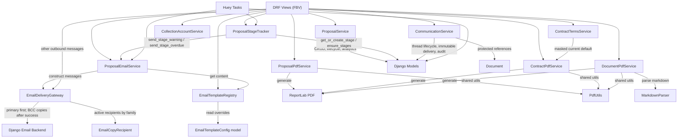
```mermaid
flowchart TD
    Views["DRF Views (FBV)"] --> PS["ProposalService"]
    Views --> PES["ProposalEmailService"]
    Views --> PPDF["ProposalPdfService"]
    Views --> CPDF["ContractPdfService"]
    Views --> CTS["ContractTermsService"]
    Views --> ETR["EmailTemplateRegistry"]
    Views --> DPS["DocumentPdfService"]
    Views --> CMS["CommunicationService"]
    Views --> CAS["CollectionAccountService"]
    Views --> PST["ProposalStageTracker"]

    PS -->|CRUD, lifecycle, analytics| Models["Django Models"]
    PES -->|construct messages| EDG["EmailDeliveryGateway"]
    Views -->|other outbound messages| EDG
    EDG -->|primary first; BCC copies after success| SMTP["Django Email Backend"]
    EDG -->|active recipients by family| CECR["EmailCopyRecipient"]
    PES -->|get content| ETR
    PST -->|get_or_create_stage / ensure_stages| Models
    PST -->|send_stage_warning / send_stage_overdue| PES
    PPDF -->|generate| ReportLab["ReportLab PDF"]
    PPDF -->|shared utils| PU["PdfUtils"]
    CPDF -->|generate| ReportLab
    CPDF -->|shared utils| PU
    CTS -->|masked current default| CPDF
    DPS -->|generate| ReportLab
    DPS -->|shared utils| PU
    DPS -->|parse markdown| MP["MarkdownParser"]
    CMS -->|thread lifecycle, immutable delivery, audit| Models
    CMS -->|protected references| Documents["Document"]
    ETR -->|read overrides| ETC["EmailTemplateConfig model"]

    HueyTasks["Huey Tasks"] --> PES
    HueyTasks --> PST
    HueyTasks --> Models
```

### Service Responsibilities

| Service | Footprint | Responsibilities |
|---------|-----------|-----------------|
| **ProposalService** | Very large | Proposal CRUD, section management, default sections, analytics computation, engagement scoring, dashboard aggregation, CSV export, scorecard |
| **ProposalEmailService** | Very large | All email sending: proposal sent (single + multi-proposal envelope), reminders, urgency, abandonment, revisit alerts, stakeholder alerts, engagement decay, post-expiration, branded + proposal composed emails, stage warning + stage overdue. Shared helpers: `_attach_commercial_pdf(email, proposal)` (used by `send_proposal_to_client`, `send_acceptance_confirmation`, `send_multi_proposal_to_client`), `_build_initial_email_context(proposal)` (per-proposal phase context), `_send_stage_notification`. |
| **EmailDeliveryGateway** | Small | The only production owner of Django mail I/O. Requires every key in the universal inventory plus explicit client/internal/security classification, persists baseline history, sends the primary envelope first, resolves segmented BCC recipients only after success, deduplicates original recipients, isolates copy failures and exposes one delivery trace to `EmailLog`. |
| **OutboundEmailInventory** | Small | Authoritative mapping of all 56 outbound template keys to one of eight configurable copy families. Unknown keys fail closed; static tests reject mail calls outside the gateway. `ClientEmailInventory` remains the exact client-only compatibility subset. |
| **ProposalStageTracker** | Small | Day-by-day decision logic for project-stage email notifications. Holds the canonical `STAGE_DEFINITIONS` catalog (`design`, `development`), `ensure_stages` / `get_or_create_stage` helpers, `format_remaining_time(days)` (`"hoy"`, `"1 día"`, `"1 semana 5 días"`), and `process(proposal)` decision tree (70%-elapsed warning + every-3-days overdue reminders). |
| **ProposalPdfService** | Large | PDF generation with ReportLab: all 12 section types rendered to PDF |
| **ContractPdfService** | Medium | Contract PDF generation with contractor signature block, draft mode (no signature), Helvetica font, clickable TOC |
| **ContractTermsService** | Small | Resolves only the current default contract, applies draft masking through ContractPdfService, splits Markdown H2 clauses into stable anchors, and returns the public index/document payload. |
| **EmailTemplateRegistry** | Large | Centralized registry of all email templates with default content, admin-editable overrides, preview rendering, branded + proposal composed email entries |
| **PdfUtils** | Large | Shared PDF rendering utilities (fonts, colors, layout helpers) used by ProposalPdfService, ContractPdfService, and DocumentPdfService |
| **DocumentPdfService** | Medium | PDF generation for generic branded Documents with template-based rendering |
| **CommunicationService** | Small | Transactional thread/message lifecycle, direction/channel/state validation, document-reference validation, derived last activity, annulment and append-only date corrections |
| **MarkdownParser** | Small | Parses markdown content for Document PDF rendering |
| **CollectionAccountService** | Small | Collection account business logic |
| **CollectionAccountPdfService** | Small | PDF generation for collection account documents |
| **TechnicalDocumentPdf** | Medium | PDF generation for technical documents |
| **TechnicalDocumentFilter** | Small | Filtering logic for technical document modules |
| **PlatformOnboardingPdf** | Small | PDF generation for platform onboarding documents |

---

## 6. Frontend Architecture

### 6.0 Design System

Panel operational actions resolve through a semantic action catalog. Consumers keep handlers, routes, permissions and loading state locally; the catalog owns only the canonical Heroicons 24 Outline glyph and default Spanish label. `BaseActionIcon`, `BaseActionButton` and catalog-backed menus apply that metadata so icon changes remain one-place changes, while the panel action guard blocks local SVG/emoji drift and inaccessible icon-only controls in CI.

Control availability is also a design-system contract. `BaseButton`,
`BaseActionButton`, `BaseActionMenu`, `BaseSegmented` and
`BaseSegmentedMulti` accept a specific disabled reason. When the operator can
remove the block, `BaseControlGate` owns the focusable proxy around the native
disabled control, deduplicates and exposes every reason through adjacent live
copy plus hover/focus/touch help, and connects it with `aria-describedby`.
Busy-only states use `loading`; lifecycle, permission and ordering boundaries
use the same reason contract without pretending they are form errors. The
strict `check-disabled-controls.mjs` scan protects all panel routes and reachable
module components in CI.

Responsive behavior is part of the design-system contract rather than a page-level exception. The canonical device profiles live in frontend configuration and cover 412, 835, 1195, 1440 and 2560 px widths. Shared navigation stays compact through portrait tablet, modal geometry is centralized in `BaseModal`, repeated tables declare business-priority columns, and the admin content column stops growing on large monitors.

Short interface controls are atomic by default. `BaseButton`, `BaseBadge`,
`BaseSegmented` and `BaseSegmentedMulti` keep text, count and icon together;
segmented groups may wrap between complete options while preserving equal-height
controls. `BaseModal` maps intent to one width contract (`confirm`, `form`,
`form-wide`, `wizard`, `detail`, `workspace`) instead of letting consumers tune
one-off sizes. Form columns converge through `BaseFormRow`: direct fields share
label/control/error bands, explanatory copy spans the complete group, and
`BaseFormRowAction` occupies the control band so a companion action is not
centred against the label and help block.

Semantic theme tokens live in `frontend/assets/styles/theme.css` and are exposed
as Tailwind colors (`bg-surface`, `text-text-default`, `border-input-border`,
etc.). Light/dark values flip with the `.dark` class on `<html>`, toggled by
`useDiagnosticDarkMode`. Base components in `frontend/components/base/`
(`BaseInput`, `BaseSelect`, `BaseTextarea`, `BaseButton`, `BaseBadge`,
`BaseCard`, `BaseDrawer`) wrap native HTML using these tokens, so consumer markup does not
need `dark:` variants. New views must prefer these tokens and components;
legacy code (with `bg-white dark:bg-gray-700` or `bg-esmerald` literals)
coexists and migrates incrementally. See
`frontend/components/base/README.md` for the full token table and migration
example. El contrato transversal de breakpoints, anchos máximos, tablas, tabs,
filtros, modales, formularios, acciones y workspaces está en el
[estándar responsivo del panel](../RESPONSIVE_STANDARD.md). Sus cinco viewports
de aceptación son obligatorios para todo cambio de UI bajo `/panel/**`.

Responsive behavior for the internal panel is a second design-system layer.
`frontend/config/responsive.js` is the single source for width bands and the
five reference viewports. Tailwind exposes those bands as namespaced
`panel-portrait`, `panel-landscape`, `panel-desktop` and `panel-wide` screens;
the names avoid Tailwind's built-in orientation variants. `BasePageShell`
enforces the 1400 px general-content ceiling, while `BaseResponsiveTable`,
`BaseExploratoryList`, `BaseResponsiveTabs`, `BaseFilterTabs`, `BaseModal`,
`BaseActionMenu` and `BaseBulkActionBar` own the recurring adaptations. Legacy
`AccountingTable`,
`BaseTabs` and `ProposalFilterTabs` are compatibility aliases over the shared
implementations so modules can migrate without an all-at-once rewrite.
Table sizing is a capability of that same layer: `BaseResizeHandle` owns the
separator interaction, `useResizableTableColumns` resolves persisted preferred
tracks against fixed columns and ordered donors, and `BaseResponsiveTable`
exposes the opt-in `columnWidth`/`columnWidthsKey` contract. `BaseOverflowText`
owns measured one/two-line clipping and the touch disclosure, so consumers do
not duplicate tooltip or line-clamp heuristics. The Documents table is the
first specialized adopter and the folder-panel handle now uses the same input
primitive. Its local column contract owns order, width and per-profile behavior
together: Actions → Title → States → Date → Client → Project. Landscape keeps
Actions plus the first three data tracks and groups Client/Project under Title;
desktop restores every data track without moving Actions from the leading
position. Three-dot row menus use the same explicit contract in
`BaseResponsiveTable` and `IncomeGroupedTable`: `rowActionsLayout="menu-start"`
places a fixed 3.5 rem control track after selection and before data, removes it
from proportional width allocation, and keeps the visual header empty while
retaining the accessible name. The default `inline-end` layout deliberately
preserves legacy loose-icon rows until those actions are consolidated into a
single menu.
Intrinsic text sizing is owned by the same layer. `tableLayout.js` resolves a
semantic `wrap`/`truncate`/`atomic` policy per column;
`BaseResponsiveTable` applies it to retained and grouped values, while
`BaseExploratoryList` applies it to its mutually exclusive table/card branches.
The safe data-owned default uses `min-w-0`, a bounded content box and
`overflow-wrap:anywhere`, so strings without spaces participate correctly in
min-content sizing. Badges inherit the same containment. A feature may truncate
only when it also owns a complete-value path. Document titles deliberately use
that exception: one-line ellipsis plus measured in-place disclosure, with folder
and other distinctions ordered in a separate wrapping metadata row.
`responsiveAcceptance.js` assigns every catalog view to one of thirteen module
scripts. Pull requests execute affected modules at all five widths, the full
matrix runs monthly, and a scheduled February/August issue forces review of the
device assumptions instead of letting the contract age silently.

Accounting is the reference adoption layer for those primitives. Its twelve
pages render through `BasePageShell`; `AccountingSubnav` and saved filters use
the shared compact navigation contract; `AccountingIndicatorGroup` preserves
business-ranked KPIs; and each `AccountingTable` column carries an explicit
`keep/group/hide` policy. Grouped-income and grouped-recurring headers own a
stacked compact representation. Pocket has one mutually exclusive structural
branch below 640 px: `PocketMovementCards` renders the same movement fields as
label/value facts, with concept and signed value first and the running balance
kept as **Saldo después** or **Acumulado filtrado**. From 640 px the declared
priority table returns. `PocketMovementRowActionsButton` feeds one
`PocketMovementActionsModal` from both branches, so edit/delete semantics do not
fork with layout. Incomes and Collection Accounts use the same leading menu in
their classic and grouped tables. Long modal flows declare a semantic `kind`,
and all compact badges use the atomic `BaseBadge` contract.

`BaseDrawer` is the shared transient second zone for compact panel views: it
teleports to `body`, traps focus, closes on backdrop/Escape, locks body scroll
and supports left/right/bottom placement. `BaseModal` keeps the Phase 1 semantic
size vocabulary and its canonical phone-fullscreen behavior; Phase 3 consumers
only provide scrollable bodies and sticky actions where their workflow needs it.

### 6.0.1 Responsive panel contract

| Viewport | Layout role | Documentos | Clientes | Proyectos |
|----------|-------------|------------|----------|-----------|
| 412×915 | Phone | Folder drawer + gallery | Filter/action drawers + stacked records | One-column cards + secondary-KPI disclosure |
| 835×1194 | Portrait tablet | Folder drawer + two-column gallery | Same progressive filters + full KPI row | Two-column cards |
| 1195×835 | Landscape tablet | Two zones + prioritized table | Visible two-level filters | Sortable table |
| 1440×900 | Laptop | Full desktop information | Full desktop information | Full desktop information |
| 2560×1440 | Large monitor | 1400 px centered cap | 1400 px centered cap | 1400 px centered cap |

The compact decision comes from
`PANEL_BREAKPOINTS.landscape` in `frontend/config/responsive.js`, not a
collection of independent CSS hides. Each branch owns one interactive DOM so
drawers, rows and action menus are never duplicated for assistive technology or
Playwright. Data, filters and URL state stay in the existing stores/composables;
the responsive layer changes presentation only.

### 6.1 Page Routing


```mermaid
flowchart TD
    subgraph Public["Public Pages (SSR)"]
        Home["/"]
        Landing1["/landing-web-design"]
        Landing2["/landing-software"]
        Landing3["/landing-apps"]
        About["/about-us"]
        Portfolio["/portfolio-works"]
        PortfolioDetail["/portfolio-works/:slug"]
        Blog["/blog"]
        BlogDetail["/blog/:slug"]
        Contact["/contact"]
        ContactSuccess["/contact-success"]
    end

    subgraph SPA["SPA Pages"]
        Proposal["/proposal/:uuid"]
        Panel["/panel/ (Dashboard)"]
        PanelLogin["/panel/login"]
        ProposalsList["/panel/proposals"]
        ProposalCreate["/panel/proposals/create"]
        ProposalEdit["/panel/proposals/:id/edit (tabs: General, Correos, Documentos, Cronograma, Secciones, Det. técnico, Prompt, JSON, Actividad, Analytics)"]
        ProposalDefaults["/panel/proposals/defaults"]
        EmailTemplates["/panel/proposals/email-templates"]
        EmailDeliverability["/panel/proposals/email-deliverability"]
        BlogAdmin["/panel/blog"]
        BlogCreate["/panel/blog/create"]
        BlogEdit["/panel/blog/:id/edit"]
        BlogCalendar["/panel/blog/calendar"]
        PortfolioAdmin["/panel/portfolio"]
        PortfolioCreate["/panel/portfolio/create"]
        PortfolioEdit["/panel/portfolio/:id/edit"]
        Clients["/panel/clients"]
        Admins["/panel/admins"]
        DocumentsAdmin["/panel/documents"]
        DocumentCreate["/panel/documents/create"]
        DocumentEdit["/panel/documents/:id/edit"]
        CommunicationsAdmin["/panel/communications"]
        EmailsPage["/panel/emails"]
        ViewsPage["/panel/views"]
        TasksPage["/panel/tasks (internal Kanban)"]
        DiagnosticsAdmin["/panel/diagnostics + /create + /:id/edit + /defaults"]
        DefaultsPage["/panel/defaults (Propuesta / Diagnóstico)"]
        StyleguidePage["/panel/styleguide"]
        McpsPage["/panel/mcps (superuser)"]
        AccountingPage["/panel/accounting/* (superuser: incomes, expenses, recurring, cards, hostings, ads, pocket, history, settings)"]
    end

    subgraph Platform["Platform Pages (JWT Auth)"]
        PlatformLogin["/platform/login"]
        PlatformVerify["/platform/verify"]
        PlatformProfile["/platform/complete-profile"]
        PlatformDashboard["/platform/dashboard"]
        PlatformBoard["/platform/board"]
        PlatformProjects["/platform/projects"]
        PlatformProjectDetail["/platform/projects/:id"]
        PlatformProjectBoard["/platform/projects/:id/board"]
        PlatformProjectBugs["/platform/projects/:id/bugs"]
        PlatformProjectChanges["/platform/projects/:id/changes"]
        PlatformProjectDeliverables["/platform/projects/:id/deliverables"]
        PlatformProjectPayments["/platform/projects/:id/payments"]
        PlatformClients["/platform/clients"]
        PlatformClientDetail["/platform/clients/:id"]
        PlatformBugs["/platform/bugs"]
        PlatformChanges["/platform/changes"]
        PlatformDeliverables["/platform/deliverables"]
        PlatformNotifications["/platform/notifications"]
        PlatformPayments["/platform/payments"]
        PlatformCollectionAccountsPage["/platform/collection-accounts"]
        PlatformCollectionAccountDetail["/platform/collection-accounts/:id"]
        PlatformProjectCollectionAccounts["/platform/projects/:id/collection-accounts"]
        PlatformProjectDataModel["/platform/projects/:id/data-model"]
        PlatformDeliverableDetail["/platform/projects/:id/deliverables/:did"]
        PlatformProfilePage["/platform/profile"]
        PlatformAccess["/platform/access (admin-only)"]
        PlatformDocuments["/platform/documents (client document-signing portal — post-login landing for clients)"]
    end

    Panel -->|middleware: admin-auth| AuthCheck["/api/auth/check/"]
    PlatformDashboard -->|middleware: platform-auth| JWTCheck["JWT validation"]
```

### 6.1.1 View Map operational Explorer

`/panel/views` now has three views over two deliberately separate catalogs:

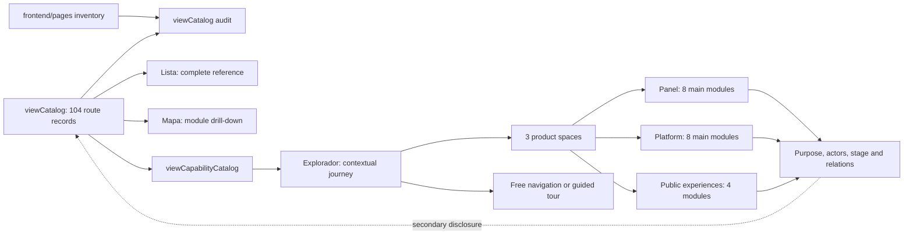
```mermaid
flowchart LR
    Pages["frontend/pages inventory"] --> Audit["viewCatalog audit"]
    Routes["viewCatalog: 104 route records"] --> Audit
    Routes --> List["Lista: complete reference"]
    Routes --> Map["Mapa: module drill-down"]
    Routes --> Capabilities["viewCapabilityCatalog"]
    Capabilities --> Explorer["Explorador: contextual journey"]
    Explorer --> Spaces["3 product spaces"]
    Spaces --> Panel["Panel: 8 main modules"]
    Spaces --> Platform["Platform: 8 main modules"]
    Spaces --> Public["Public experiences: 4 modules"]
    Panel --> Benefits["Purpose, actors, stage and relations"]
    Platform --> Benefits
    Public --> Benefits
    Explorer --> Tour["Free navigation or guided tour"]
    Benefits -. secondary disclosure .-> Routes
```

`viewCatalog.js` remains the canonical technical inventory. A CI scanner derives
routes from real page files and rejects missing, stale, duplicated or invalid
records. `viewCapabilityCatalog.js` is a curated operational projection: its
validator requires all 104 routes and all seven technical sections to belong to
exactly one product feature/space, while every relationship endpoint must exist.
The hierarchy starts with Panel interno, Plataforma de clientes and Experiencias
públicas; main modules lead to representative submodules and technical routes.

`ViewOperationalExplorer` has one semantic interaction model with two visual
branches: compact/portrait renders module cards, while landscape and wider
profiles render positioned buttons over a lightweight SVG relationship layer.
Hover or focus writes only an ephemeral preview into
`ViewExplorerContextPanel`; selection writes the stable node. Guided tours use
the main modules of one space as ordered steps, pause automatic rotation, and
are rendered by `ViewExplorerTourControls`. Mode, selected node, tour and
relation visibility are URL state (`viewMode`, `node`, `tour`, `relations`);
stopping a tour removes only `tour`, preserving `node`. Only the default mode is
persisted by `ViewMapSettings`. No live metrics or additional API are involved.

### 6.1.2 Client Chart Loading

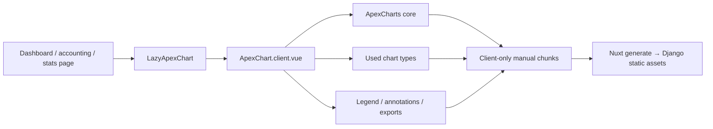
```mermaid
flowchart LR
    Page["Dashboard / accounting / stats page"] --> Lazy["LazyApexChart"]
    Lazy --> Client["ApexChart.client.vue"]
    Client --> Core["ApexCharts core"]
    Client --> Types["Used chart types"]
    Client --> Features["Legend / annotations / exports"]
    Core --> Chunks["Client-only manual chunks"]
    Types --> Chunks
    Features --> Chunks
    Chunks --> Static["Nuxt generate → Django static assets"]
```

Charts are lazy and client-only: there is no global ApexCharts plugin in the Nuxt bootstrap. The wrapper owns the modular imports, while `vite.$client` splits ApexCharts and GSAP without changing Nitro's server graph. This keeps chart code away from routes that do not render charts and enforces the 500 KB client-chunk budget used by the production build.

### 6.2 Store Architecture

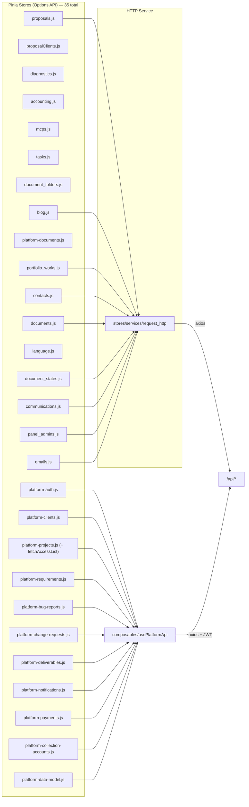
```mermaid
flowchart LR
    subgraph Stores["Pinia Stores (Options API) — 35 total"]
        ProposalStore["proposals.js"]
        ProposalClientsStore["proposalClients.js"]
        DiagnosticsStore["diagnostics.js"]
        AccountingStore["accounting.js"]
        McpsStore["mcps.js"]
        TasksStore["tasks.js"]
        DocumentFoldersStore["document_folders.js"]
        DocumentStatesStore["document_states.js"]
        PlatformDocumentsStore["platform-documents.js"]
        BlogStore["blog.js"]
        PortfolioStore["portfolio_works.js"]
        ContactStore["contacts.js"]
        LanguageStore["language.js"]
        DocumentStore["documents.js"]
        CommunicationsStore["communications.js"]
        PanelAdmins["panel_admins.js"]
        PlatformAuth["platform-auth.js"]
        PlatformClients["platform-clients.js"]
        PlatformProjects["platform-projects.js (+ fetchAccessList)"]
        PlatformRequirements["platform-requirements.js"]
        PlatformBugReports["platform-bug-reports.js"]
        PlatformChangeRequests["platform-change-requests.js"]
        PlatformDeliverables["platform-deliverables.js"]
        PlatformNotifications["platform-notifications.js"]
        PlatformPayments["platform-payments.js"]
        PlatformCollectionAccounts["platform-collection-accounts.js"]
        PlatformDataModel["platform-data-model.js"]
        EmailsStore["emails.js"]
    end

    subgraph HTTP["HTTP Service"]
        RequestHTTP["stores/services/request_http"]
    end

    ProposalStore --> RequestHTTP
    BlogStore --> RequestHTTP
    PortfolioStore --> RequestHTTP
    ContactStore --> RequestHTTP
    DocumentStore --> RequestHTTP
    DocumentStatesStore --> RequestHTTP
    CommunicationsStore --> RequestHTTP
    PanelAdmins --> RequestHTTP
    PlatformAuth --> PlatformHTTP["composables/usePlatformApi"]
    PlatformClients --> PlatformHTTP
    PlatformProjects --> PlatformHTTP
    PlatformRequirements --> PlatformHTTP
    PlatformBugReports --> PlatformHTTP
    PlatformChangeRequests --> PlatformHTTP
    PlatformDeliverables --> PlatformHTTP
    PlatformNotifications --> PlatformHTTP
    PlatformPayments --> PlatformHTTP
    PlatformCollectionAccounts --> PlatformHTTP
    PlatformDataModel --> PlatformHTTP
    EmailsStore --> RequestHTTP

    RequestHTTP -->|axios| API["/api/*"]
    PlatformHTTP -->|axios + JWT| API
```

### 6.3 Proposal Admin List — Filters & Tabs


```mermaid
flowchart TD
    ProposalsList["pages/panel/proposals/index.vue"]
    ProposalsList --> ProposalStore["proposals.js (Pinia)"]
    ProposalsList --> useProposalFilters["useProposalFilters.js"]

    useProposalFilters --> FilterState["reactive currentFilters (11 dimensions)"]
    useProposalFilters --> TabState["savedTabs (localStorage + URL sync)"]
    useProposalFilters --> ApplyFilters["applyFilters() — single-pass client-side"]

    ProposalsList --> FilterTabs["ProposalFilterTabs.vue"]
    FilterTabs --> TabBar["Tab bar: Todas + saved tabs + '+' button"]
    FilterTabs --> TabActions["Rename / Delete context menu"]

    ProposalsList --> FilterPanel["ProposalFilterPanel.vue"]
    FilterPanel --> StatusPills["Status multi-select pills"]
    FilterPanel --> Dropdowns["Project type / Market type dropdowns"]
    FilterPanel --> Ranges["Investment / Heat score / View count ranges"]
    FilterPanel --> Dates["Created / Last activity date ranges"]
    FilterPanel --> Toggles["Currency / Language / Active status toggles"]
```

### 6.4 Proposal Client View Architecture


```mermaid
flowchart TD
    ProposalPage["pages/proposal/[uuid]/index.vue"]
    ProposalPage --> ProposalStore
    ProposalPage --> useProposalNavigation
    ProposalPage --> useExpirationTimer
    ProposalPage --> useProposalTracking
    ProposalPage --> useSectionAnimations
    ProposalPage --> GSAP["GSAP ScrollTrigger (horizontal scroll)"]

    ProposalPage --> Gateway["ProposalViewGateway: executive / detailed / technical / legal"]
    ProposalPage --> Sections["Section Components (18 section types; web-only types like roi_projection render here but skip the PDF)"]
    ProposalPage --> ContractTerms["Synthetic legal panels: overview/index → continuous contract"]
    ContractTerms --> ContractTermsAPI["GET /api/proposals/:uuid/contract-terms/"]
    ContractTerms --> ContractDraftAPI["GET /api/proposals/:uuid/contract/draft-pdf/"]
    Sections --> Greeting
    Sections --> ExecutiveSummary
    Sections --> ContextDiagnostic
    Sections --> ConversionStrategy
    Sections --> DesignUX
    Sections --> CreativeSupport
    Sections --> DevelopmentStages
    Sections --> FunctionalRequirements
    Sections --> Timeline
    Sections --> Investment
    Sections --> FinalNote

    NextStepsData["next_steps.content_json"] -->|steps + intro| FinalNote
    NextStepsData -->|CTA + contacts| ProposalClosing
    FinalNote --> KickoffColumns["Two columns: commitment + kickoff"]
    FinalNote --> KickoffDisclosure["Closed disclosure: schedule prerequisites"]

    ProposalPage --> ProposalClosing["Synthetic final closing panel"]

    FunctionalRequirements --> ItemRequirementsMap["item id → linked technical requirements"]
    ItemRequirementsMap --> LinkedRequirementsModal["Ver requerimientos (N)"]

    ProposalPage --> Overlays["Overlay Components"]
    Overlays --> ProposalIndex
    Overlays --> SectionCounter
    Overlays --> ExpirationBadge
    Overlays --> PdfDownloadButton
    Overlays --> ShareProposalButton
    Overlays --> ProposalExpired
```

`next_steps` is data-only in the public route: it is not rendered as an independent horizontal panel. Its prerequisite steps are merged into `FinalNote`, while commercial calls to action and contact channels are passed to the synthetic `ProposalClosing` panel in detailed, executive and technical modes. This keeps the commitment narrative distinct from the final response/contact surface.

Commercial item traceability is inclusion-aware. Visible base groups always require coverage; calculator modules require it only when selected/default-selected, and hidden groups are ignored. `TechnicalDocumentEditor` blocks saving when an included item has no technical requirement in `linked_item_ids`, but reports unselected optional gaps as non-blocking warnings. The same mapping powers the client-facing “Ver requerimientos (N)” link for base and contracted-module cards.

---

## 7. Async Task Architecture


```mermaid
flowchart TD
    subgraph Triggers["Task Triggers"]
        SendAction["Admin: Send Proposal"]
        DailyCron["Daily Cron (midnight)"]
        TrackEndpoint["Client: Track Engagement"]
    end

    subgraph HueyTasks["Huey Tasks"]
        SendReminder["send_proposal_reminder"]
        SendUrgency["send_urgency_reminder"]
        ExpireStale["expire_stale_proposals (periodic)"]
        SendAbandon["send_abandonment_email"]
        SendRevisit["send_revisit_alert"]
        SendInvestment["send_investment_interest_email"]
        SendStakeholder["send_stakeholder_alert"]
        SendPostExpiry["send_post_expiration_alert"]
        SendEngagementDecay["send_engagement_decay_alert"]
        SendCalcFollowup["send_calculator_followup"]
        RefreshHeatScores["refresh_all_heat_scores (periodic)"]
        AutoArchive["auto_archive_stale_proposals (periodic)"]
        StageDeadlines["notify_proposal_stage_deadlines (periodic — daily 13:30 UTC = 08:30 Bogotá)"]
        AutoChargeSubs["auto_charge_due_subscriptions (periodic — daily 06:00; stored-card hosting billing + prorated phase onboarding)"]
        CardDebtReminder["send_card_debt_reminder (periodic — Fridays; accounting card-debt, re-alerts every 2 days until a snapshot clears the cycle)"]
        NightlyRebuild["nightly_frontend_rebuild (periodic — 02:30, @lock_task 'frontend-rebuild')"]
        RebuildPrerender["rebuild_frontend_prerender (on blog publish; @lock_task 'frontend-rebuild', retries=2)"]
    end

    subgraph MoreTriggers["More Triggers"]
        BlogPublish["Blog create/update/delete or scheduled publish"]
    end

    SendAction -->|schedule delay| SendReminder
    SendAction -->|schedule delay| SendUrgency
    DailyCron --> ExpireStale
    DailyCron --> RefreshHeatScores
    DailyCron --> AutoArchive
    DailyCron --> StageDeadlines
    DailyCron --> AutoChargeSubs
    DailyCron --> CardDebtReminder
    DailyCron --> NightlyRebuild
    BlogPublish -->|coalesced 120s| RebuildPrerender
    TrackEndpoint -->|conditional| SendAbandon
    TrackEndpoint -->|conditional| SendRevisit
    TrackEndpoint -->|conditional| SendInvestment
    TrackEndpoint -->|conditional| SendStakeholder
    TrackEndpoint -->|conditional| SendPostExpiry
    TrackEndpoint -->|conditional| SendEngagementDecay
    TrackEndpoint -->|conditional| SendCalcFollowup
    StageDeadlines -->|via ProposalStageTracker.process| HueyTasksOut["send_stage_warning / send_stage_overdue (internal team)"]
```

---

## 8. Deployment Architecture

```
Client (HTTPS)
    │
    ▼
Nginx (SSL termination, Let's Encrypt)
    ├── /static/  → backend/staticfiles/
    ├── /media/   → backend/media/
    └── /*        → unix:/run/projectapp.sock
                        │
                        ▼
                   Gunicorn (2 workers)
                        │
                        ▼
                   Django (settings_prod)
                   ├── /api/*     → DRF views
                   ├── /admin/*   → Django admin
                   └── /*         → serve_nuxt (pre-rendered Nuxt pages)

Systemd Services:
  - projectapp.service  → Gunicorn (via projectapp.socket)
  - projectapp-huey     → Huey worker

Redis:
  - redis://localhost:6379/5  → Huey task queue

MySQL:
  - localhost:3306  → projectapp_db
```

### Production Build Flow

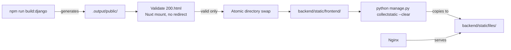
```mermaid
flowchart LR
    NuxtBuild["npm run build:django"]
    NuxtBuild -->|generates| NuxtOutput[".output/public/"]
    NuxtOutput --> FallbackGate["Validate 200.html<br/>Nuxt mount, no redirect"]
    FallbackGate -->|valid only| AtomicSwap["Atomic directory swap"]
    AtomicSwap --> StaticFrontend["backend/static/frontend/"]
    CollectStatic["python manage.py collectstatic --clear"]
    StaticFrontend --> CollectStatic
    CollectStatic -->|copies to| StaticFiles["backend/staticfiles/"]
    Nginx -->|serves| StaticFiles
```

Nuxt payload data stays inline because the generated site is mounted below `app.cdnURL=/static/frontend/`; external `_payload.json` URLs are not part of this deployment topology. Private routes are deliberately not prerendered and therefore depend on the root `200.html` SPA shell. The build refuses to publish a fallback that is empty, redirects, or lacks `#__nuxt`. Django owns the locale redirect for the bare root through the preferred-locale cookie and nginx country header; Nuxt browser-language detection stays disabled so it cannot rewrite the unprefixed fallback. Clearing `staticfiles/` on every deploy and blog rebuild prevents old content-hashed chunks and file/directory collisions from surviving publication.

---

## 9. Current Workflow

### Proposal Creation → Client View → Close

The explicit `$proposal-create` / `/proposal-create` workflow can precede the panel: it asks for unresolved commercial decisions, exports active defaults, produces and audits JSON + a decision manifest, then—only after a separate approval—creates an unsent draft through the same serializer/service used by JSON import.

1. Admin creates proposal via `/panel/proposals/create` (or JSON import)
2. Admin selects an existing client from `<ClientAutocomplete>` (or types a new one). Backend resolves the client via `proposal_client_service.get_or_create_client_for_proposal()` — case-insensitive dedup by `User.email`, never hijacks admin accounts. Empty emails get a placeholder `cliente_<id>@temp.example.com` (RFC 2606 reserved TLD) generated via two-step save, which automatically pauses every email automation for that proposal until a real address is entered.
3. 18 section types auto-generated with default content per language (some web-only, skipping the PDF). The frontend seller prompt and backend `_seller_prompt.bold_formatting` share the same 14-field lead-copy emphasis contract; both must remain aligned. `show_contract_terms` remains separate top-level metadata, so enabling the fourth reading mode does not mutate this section snapshot or its prompt/JSON shape.
4. Admin edits sections via `/panel/proposals/{id}/edit` (client picker also available there; can be swapped or its profile updated via the propagate-changes checkbox which cascades the snapshot to every other linked proposal)
5. Admin clicks "Send" → email sent to client + admin notification + reminders scheduled (skipped silently if client email is a placeholder)
6. Client opens unique link `/proposal/{uuid}`
7. The gateway offers executive, detailed and technical views; eligible Spanish proposals also offer **Contrato y condiciones**. That legal mode lazily loads the current masked global template into a full-content-width intro/index panel followed by one continuous vertical contract panel contained in one semantic, accessible paper surface. PDF download remains a persistent floating proposal action and is not duplicated inside the introduction.
8. Engagement tracked: view events, section time, session ID, reading mode, and the active technical fragment or legal clause in `subsection_key`
9. Automated emails triggered based on behavior (reminder, urgency, abandonment, etc.) — every client-facing send checks `_is_unsendable_client_email()` first, so placeholder accounts never receive mail
10. Client responds: accept / reject (with reason) / negotiate / comment. Acceptance fires `ProposalEmailService.send_acceptance_confirmation()` to the client (this branch was added 2026-04-09 — see ERR-007).
11. Admin monitors via dashboard, alerts, analytics, scorecard. Orphan clients (zero proposals, zero projects) can be cleaned up from `/panel/clients` Huérfanos tab.

### Hosting Terms → Public Snapshot → Operational Billing

1. `BusinessProposal` and `ProposalDefaultConfig` own the 9/6/3-month discounts; `ProposalSection.content_json.hostingPlan` mirrors their presentation.
2. `normalize_hosting_plan()` enforces the current catalog for active draft/sent/viewed/negotiating/expired proposals, so the public serializer and `ProposalPdfService` calculate from one shape.
3. Closed or inactive proposals keep their stored tiers for contractual history. Platform onboarding explicitly requests current terms when it turns an accepted proposal into a new `Project` snapshot.
4. Current `HostingSubscription` and active accounting `HostingRecord` rows use `nine_month`; cancelled/archived subscriptions, paid `Payment`/`HostingCycle` rows and inactive records retain legacy values and historical labels.
5. Data migrations abort before changing a subscription when an unpaid annual payment is processing or already linked to Wompi; safe pending payments are recalculated to nine months.

### Recurring Inputs → Canonical COP Projections → Budget Totals

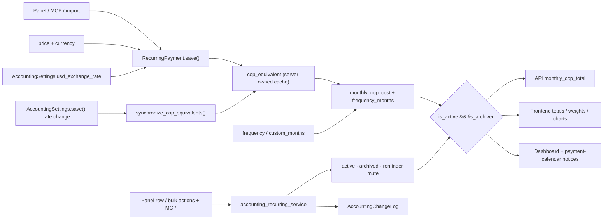
```mermaid
flowchart LR
    Writers["Panel / MCP / import"] --> Save["RecurringPayment.save()"]
    Inputs["price + currency"] --> Save
    Rate["AccountingSettings.usd_exchange_rate"] --> Save
    Save --> Equivalent["cop_equivalent (server-owned cache)"]
    Equivalent --> Monthly["monthly_cop_cost ÷ frequency_months"]
    Frequency["frequency / custom_months"] --> Monthly
    Monthly --> BudgetGate{"is_active && !is_archived"}
    BudgetGate --> General["API monthly_cop_total"]
    BudgetGate --> Category["Frontend totals / weights / charts"]
    BudgetGate --> Notices["Dashboard + payment-calendar notices"]
    RateChange["AccountingSettings.save() rate change"] --> Sync["synchronize_cop_equivalents()"]
    Sync --> Equivalent
    RowActions["Panel row / bulk actions + MCP"] --> Lifecycle["accounting_recurring_service"]
    Lifecycle --> State["active · archived · reminder mute"]
    State --> BudgetGate
    Lifecycle --> Audit["AccountingChangeLog"]
```

The configured rate is a current-rate policy, not a historical snapshot. A settings-rate change updates every stored USD equivalent atomically; ordinary recurring writes derive their own equivalent and ignore client-supplied cache values. The API then serializes the refreshed monthly projection, so the general total and the frontend category sums consume the same canonical rows. Migration `content.0208` performs the one-time historical repair.

Lifecycle is a separate service boundary. `accounting_recurring_service` owns state, archive/restore, reminder mute, duplicate drafts and transaction-locked bulk writes; the panel endpoints and six accounting MCP tools converge there and audit every changed row without sending accounting-change email noise. List/export scope is explicit (`archive_scope=current|archived|all`), restore is inactive by construction, and hard delete is rejected until archive. Migration `content.0219_recurring_lifecycle` adds the archive and mute state. A duplicate endpoint returns form seed data only: the ordinary create path remains the sole writer. No edge in this graph creates an `ExpenseRecord` or `PocketMovement`; registering a period charge is intentionally a later ledger-origin architecture.

### Collection Accounts → Grouped Receivables View

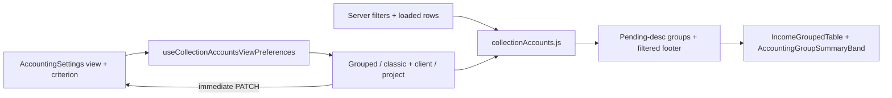
```mermaid
flowchart LR
    Settings["AccountingSettings view + criterion"] --> Preferences["useCollectionAccountsViewPreferences"]
    Preferences --> Controls["Grouped / classic + client / project"]
    Filters["Server filters + loaded rows"] --> Grouping["collectionAccounts.js"]
    Controls --> Grouping
    Grouping --> Groups["Pending-desc groups + filtered footer"]
    Groups --> Shared["IncomeGroupedTable + AccountingGroupSummaryBand"]
    Controls -->|immediate PATCH| Settings
```

The collection list endpoint remains the row source; grouping and aggregation are
deterministic presentation logic over the filtered result. One utility owns the
money contract: issued includes issued + paid, pending includes issued, collected
includes paid, cancelled includes cancelled, and drafts contribute no money. Its
status breakdown is separate, with overdue derived from an issued row's due date
and therefore intentionally overlapping the issued count. Project keys prefer the
live relation, preserve a different historical snapshot as `<name> (histórico)`,
and reserve a final unassigned group for a genuinely absent project. The global
settings row persists both controls together; an optimistic save rolls the UI back
when the PATCH fails.

### Document Event → Episode → Current State

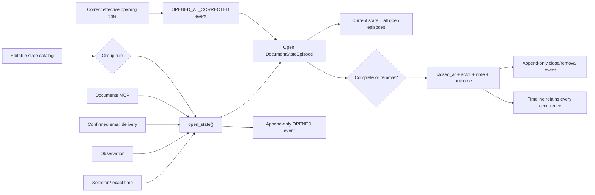
```mermaid
flowchart LR
    Catalog["Editable state catalog"] --> Rule{"Group rule"}
    Manual["Selector / exact time"] --> Open["open_state()"]
    Note["Observation"] --> Open
    Email["Confirmed email delivery"] --> Open
    MCP["Documents MCP"] --> Open
    Rule --> Open
    Open --> Episode["Open DocumentStateEpisode"]
    Open --> Event["Append-only OPENED event"]
    Episode --> Current["Current state = all open episodes"]
    Episode --> Finish{"Complete or remove?"}
    Finish --> Close["closed_at + actor + note + outcome"]
    Close --> CloseEvent["Append-only close/removal event"]
    Close --> History["Timeline retains every occurrence"]
    Correction["Correct effective opening time"] --> EventCorrection["OPENED_AT_CORRECTED event"]
    EventCorrection --> Episode
```

`document_state_service` is the only workflow writer and locks the document before
enforcing exclusivity, declared incompatibilities and repeatability. The document-
local episode event stream is the canonical audit for state changes; generic history
does not duplicate those movements. Catalog renames preserve stable integration keys,
and merging retires the source while keeping historical meaning and merge events.
`document_note_service` owns note linkage and only closes needs-fix after the final
undeleted open linked observation is resolved, discarded or deleted. Client visibility
is orthogonal and never derived from an episode.

### Observation Decision → Recoverable Trash → State Reconciliation

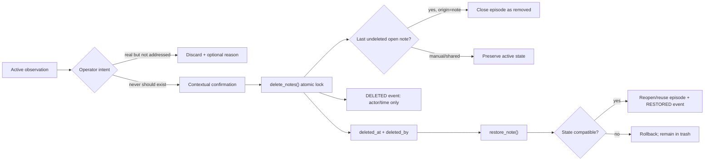
```mermaid
flowchart LR
    Active["Active observation"] --> Choice{"Operator intent"}
    Choice -->|"real but not addressed"| Discard["Discard + optional reason"]
    Choice -->|"never should exist"| Confirm["Contextual confirmation"]
    Confirm --> Atomic["delete_notes() atomic lock"]
    Atomic --> Trash["deleted_at + deleted_by"]
    Atomic --> Audit["DELETED event: actor/time only"]
    Atomic --> Pending{"Last undeleted open note?"}
    Pending -->|"yes, origin=note"| RemoveState["Close episode as removed"]
    Pending -->|"manual/shared"| PreserveState["Preserve active state"]
    Trash --> Restore["restore_note()"]
    Restore --> Compatible{"State compatible?"}
    Compatible -->|yes| Reopen["Reopen/reuse episode + RESTORED event"]
    Compatible -->|no| Rollback["Rollback; remain in trash"]
```

`DocumentNote.deleted_at/deleted_by` is the recoverable record; default document,
history and episode serializers exclude it. `DocumentNoteEvent` is append-only and
deliberately omits content snapshots. REST and the Documents MCP converge on the
same locked service, including one-document bulk validation and automatic state
coherence. The note manager renders active, trash and activity panes inside the
existing `BaseModal`; destructive confirmation is an internal state of that dialog,
so no nested browser prompt or one-click list deletion exists.

Panel dialog policy is enforced separately from individual consumers: confirmations
and text capture use `BaseModal`/`ConfirmModal`, errors remain inline/actionable, and
`check-panel-native-dialogs.mjs` scans every reachable panel page/component in CI.

### Project State Preview → Consequences → Episode

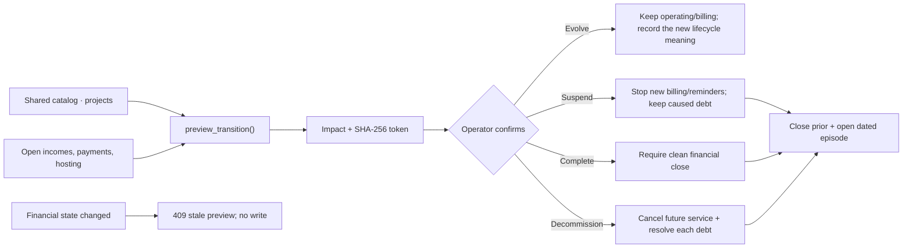
```mermaid
flowchart LR
    Catalog["Shared catalog · projects"] --> Preview["preview_transition()"]
    Financial["Open incomes, payments, hosting"] --> Preview
    Preview --> Token["Impact + SHA-256 token"]
    Token --> Decision{"Operator confirms"}
    Decision -->|Evolve| Continue["Keep operating/billing; record the new lifecycle meaning"]
    Decision -->|Suspend| Stop["Stop new billing/reminders; keep caused debt"]
    Decision -->|Complete| Clean["Require clean financial close"]
    Decision -->|Decommission| Final["Cancel future service + resolve each debt"]
    Stop --> Episode["Close prior + open dated episode"]
    Clean --> Episode
    Final --> Episode
    Changed["Financial state changed"] --> Reject["409 stale preview; no write"]
```

`project_state_service` is the only lifecycle writer. It locks the project and
financial rows, recalculates the impact token and applies consequences atomically.
The editable label never drives behavior: `DocumentState.operational_effect` does.
`DocumentState.description` is editable explanatory copy, while
`operational_effect_help` is derived from that immutable effect so a rename cannot
misrepresent billing or closure consequences. `ProjectStateHelpBadge` renders both
layers throughout the internal Projects panel. **Activo** and **En evolución** are
distinct catalog meanings that deliberately share the `operating` effect.
The legacy `Project.status` remains a compatibility mirror, while new panel and
platform writes cannot mutate it directly. Hosting failure produces a manual
suggestion only; no timer automatically moves Suspendido to Dado de baja.

### Client Communication → Manual Send Fact → Reply Context

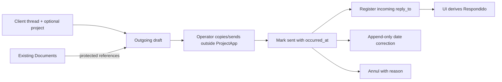
```mermaid
flowchart LR
    Thread["Client thread + optional project"] --> Draft["Outgoing draft"]
    Draft --> Copy["Operator copies/sends outside ProjectApp"]
    Copy --> Sent["Mark sent with occurred_at"]
    Sent --> Reply["Register incoming reply_to"]
    Reply --> Responded["UI derives Respondido"]
    Documents["Existing Documents"] -->|protected references| Draft
    Sent --> Correction["Append-only date correction"]
    Sent --> Void["Annul with reason"]
```

Phase 1 is deliberately a registry, not a transport. A manual source records the
operator's assertion that a message was sent; it never impersonates an SMTP or
WhatsApp delivery receipt. A later email phase must enter through
`EmailDeliveryGateway` and atomically associate the existing `EmailLog` seam.
Historical conversations keep their original client: when a project changes
owner, its threads are detached from the project rather than reassigned.

### Modal-Owned Floating Listboxes

`BaseFloatingListbox` is the shared rendering boundary for searchable selectors
inside `BaseModal`. The modal provides a dedicated floating root outside its
overflow panel; listboxes teleport there, position themselves against their
input, clamp to the viewport and flip above when that side has more room. The
same modal context registers open floating layers so the panel stays fixed while
the list owns any result overflow. The dialog-level focus trap includes the
teleported options, while Escape closes the list before it can close the modal.

`ClientAutocomplete`, `ProjectSelect`, `ProjectCatalogSelect` and the linked-
income selector in `CollectionAccountFormModal` consume that primitive. This
keeps accounting and Documents modals on one clipping, focus and scroll contract
instead of repeating per-screen absolute dropdown workarounds.

Geometry and data readiness are separate parts of that contract.
`ClientAutocomplete` requests the empty query when an uncommitted picker gains
focus, so a modal whose picker is its primary decision can focus it on open and
render a real catalog immediately. `search_proposal_clients` orders by the
display-name fallback (person name → company → email), returns at most 20 rows
for `limit`/`offset`, and keeps its historical array body while publishing the
filtered total in `X-Total-Count`. `BaseFloatingListbox` signals its scroll end;
the client picker appends the next page without duplicates while the modal stays
fixed. Empty and failed reads remain actionable inside the same layer.

The linked-income selector owns a stable view-state default rather than a
server restriction: it fetches the eligible expected/liquid pool, scopes it to
the selected client and selects `IncomeRecord.kind === 'expected'` on open and
client change. Payment status is deliberately outside this filter, preserving
partially paid projections. Its empty-state action widens kind before scope, so
the normal escape hatch keeps the selected client; no selection is persisted.

### Representative Fake Data → Coherent Cross-Module Graph

```mermaid
flowchart TD
    Guard["FAKE_DATA_ALLOWED is literally true"] --> Atomic["One outer transaction"]
    Atomic --> Identity["Platform identities + 60-client skew"]
    Identity --> Content["Proposals, blog, portfolio, tasks, diagnostics"]
    Identity --> Platform["Heavy project: 60 requirements/deliverables/changes/bugs"]
    Platform --> Accounting["Accounting + dated hosting"]
    Accounting --> Documents["IncomeRecord → collection-account service"]
    Documents --> Communications["Client threads + protected document references"]
    Communications --> Auxiliary["Email, QR, Linktree, LinkedIn, MCP history"]
    Auxiliary --> Commit{Every stage succeeded?}
    Commit -->|yes| Dataset["Commit complete dataset"]
    Commit -->|no| Rollback["Rollback every stage + non-zero exit"]
```

`content.fake_data.SeedContext` derives an isolated deterministic stream for
each namespace from one seed and provides a shared aware noon anchored to an
explicit business date. Child commands enforce the guard independently, so
calling a seeder directly cannot bypass the production stop. The orchestrator
orders accounting before documents because collection accounts are created by
the real income-backed service, and orders documents before communications so
messages can reference only documents belonging to the thread's client.

The concrete-model registry is an architectural dependency check: every
`accounts`/`content` model must be classified as seeded, derived, catalog or
explicitly exempt. The focused contract test compares that inventory with
Django's app registry and fails when a new model has no declared fake-data
owner.
