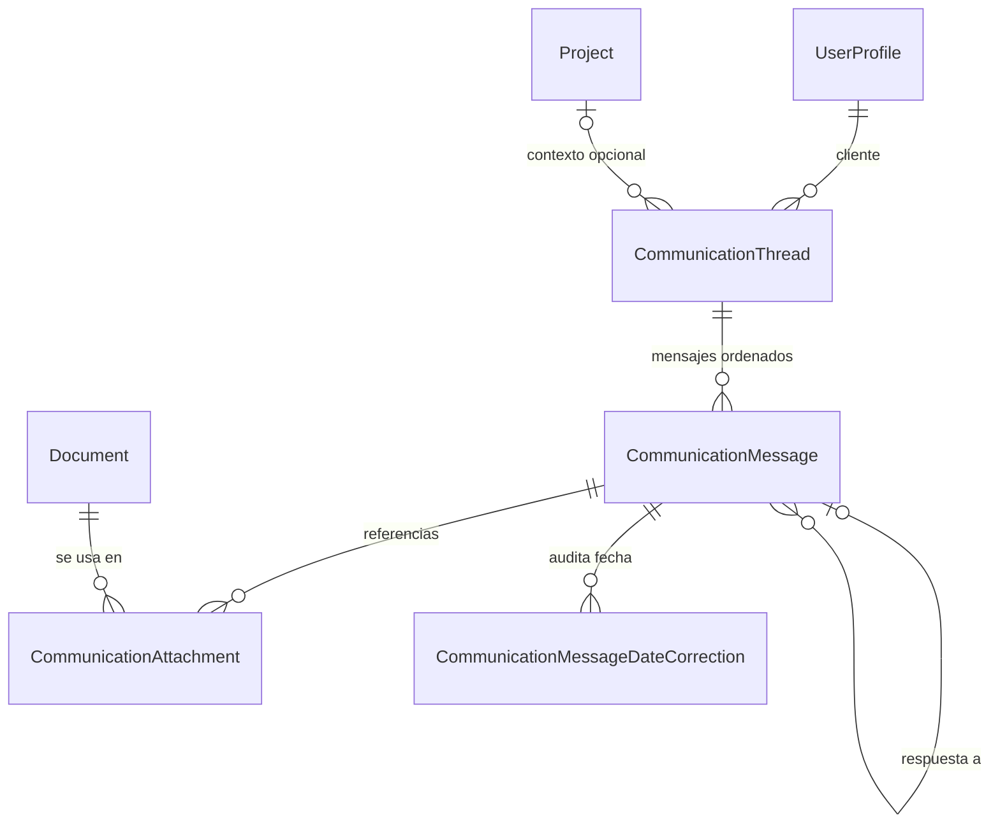

# Registro de comunicaciones con clientes — decisión y hoja de ruta

Fecha: 2026-08-25

Estado: Fase 1 implementada
Dependencia de producto: PA-58

## Decisión

Las comunicaciones viven como un **módulo de producto propio**. En el backend
comparten el Django app `content` y reutilizan clientes, proyectos, documentos,
autenticación y componentes del panel, pero no son un subtipo de `Document`.

La razón determinante es el modelo: un documento es una pieza de contenido con
un ciclo editorial; una conversación es un hilo con varios eventos ordenados,
dos direcciones, canales y estados operativos. Forzar mensajes como documentos
volvería ambiguos los listados, filtros, carpetas y estados editoriales de
Documentos, y separar esos datos después exigiría una migración costosa.

## Criterios fijados antes de evaluar

| Criterio | Extender Documentos | Módulo propio reutilizando componentes |
|---|---|---|
| Reutilización | Alta al inicio, pero mezcla almacenamiento y navegación | Alta en clientes, proyectos, documentos, auth y UI; modelo específico |
| Duplicación | Baja al inicio | Acotada a API/store/página del dominio |
| Encaje de un hilo | Débil: un `Document` no representa una secuencia bidireccional | Natural: hilo 1→N mensajes ordenados |
| Legibilidad de listados/filtros | Se degradan al mezclar piezas editoriales y conversaciones | Cada módulo conserva su vocabulario y filtros |
| Costo de separar después | Alto: migración de contenido, estados, URLs y referencias | Bajo: los límites ya existen |
| Reutilización de notas privadas | Sirven como textos auxiliares, no como historial enviado/recibido | Se mantienen independientes; podrán alimentar plantillas sin duplicar historial |

## Modelo materializado en la fase 1

- Un cliente puede tener varios hilos abiertos al mismo tiempo.
- El cliente del hilo es evidencia histórica e inmutable después de crearlo.
- El proyecto es opcional y sólo contextualiza; si el proyecto cambia de
  cliente, el hilo conserva su cliente histórico y se desvincula del proyecto.
- Cada mensaje guarda canal (`email`/`whatsapp`), dirección
  (`outgoing`/`incoming`), fecha ocurrida, contenido, estado y origen.
- Los estados persistidos son `draft`, `sent`, `received` y `failed`.
  **Respondido** es un estado de lectura derivado: un saliente enviado que ya
  tiene una respuesta entrante válida. Así no se destruye el hecho original de
  que fue enviado.
- Un mensaje entregado no se edita: puede anularse con motivo o corregirse su
  fecha mediante un evento append-only. Los borradores sí se editan/eliminan.
- Un adjunto no copia archivos. `CommunicationAttachment` referencia un
  `Document` existente; la API y la UI permiten navegar en ambas direcciones y
  bloquean borrar un documento aún referenciado.

## Alcance por canal

| Canal | Fase 1 | Fase posterior |
|---|---|---|
| WhatsApp | Copiar texto y registrar manualmente borrador/enviado/recibido | Integración sólo si existe proveedor, consentimiento y trazabilidad confiable |
| Correo | Registro manual; seam `source` + `email_log` preparado | Envío real por `EmailDeliveryGateway`, con resultado automático y sin doble registro |

La fase 1 resuelve la pérdida de constancia; no afirma que la plataforma haya
enviado algo cuando sólo se registró manualmente.

## Hoja de ruta

### Fase 1 — registro mínimo utilizable (implementada)

- Crear, consultar, filtrar, cerrar y reabrir hilos por cliente/proyecto.
- Registrar entrantes y salientes, guardar borradores y marcar envío manual.
- Mostrar Enviado/Respondido sin confundirlos.
- Referenciar documentos existentes y consultar el uso inverso.
- Anular mensajes y corregir fechas con motivo auditado.
- Integrar accesos desde Clientes, Proyectos y Documentos.
- Incluir datos demo, API tests, store tests y flujo E2E registrado.

Decisiones cerradas: módulo propio; registro manual; cliente obligatorio;
proyecto opcional; documentos referenciados; mensajes entregados inmutables.

### Fase 2 — captura y reutilización

- Plantillas de texto frecuentes por canal, con variables explícitas y preview.
- Conversión opt-in de notas privadas de Documentos en plantilla, sin convertir
  la nota en mensaje ni duplicar el documento.
- Importación/backfill de correos históricos con idempotencia.
- Alinear episodios adicionales de hilo con el contrato definitivo de PA-88 si
  ese contrato añade semántica más allá de las fechas/correcciones append-only
  ya usadas por los mensajes.

Decisiones abiertas: alcance y permisos de plantillas; versionado; estrategia
de deduplicación; qué fuentes históricas son confiables; retención.

### Fase 3 — correo enviado por la plataforma

- Enviar correo desde el compositor por el gateway existente.
- Crear el mensaje y asociar `EmailLog` dentro de una operación idempotente.
- Reflejar fallo/éxito real sin permitir que un clic genere dos mensajes.
- Incorporar respuesta por importación o registro manual antes de considerar
  recepción automática.

Decisiones abiertas: remitente/familia de copia, adjuntos como links o archivos,
reintentos, conciliación con logs existentes y threading por cabeceras de correo.

### Fase 4 — integraciones de canal y operación

- Evaluar proveedor oficial de WhatsApp y webhooks; no inferir “enviado” por una
  acción de copiar.
- Búsqueda/reportes transversales, recordatorios y métricas operativas.
- Política de archivo, exportación y conservación legal.

Decisiones abiertas: proveedor y costo, consentimiento, estados de entrega,
identidad de números, SLA de webhooks, privacidad y período de retención.

## Fuera de alcance de la fase 1

- Envío real de correo o WhatsApp.
- Sincronización automática de respuestas.
- Plantillas y automatizaciones.
- Convertir `Document.client_custom_notes` en conversaciones.
- Borrar historial como efecto secundario de borrar clientes, proyectos o
  documentos.
