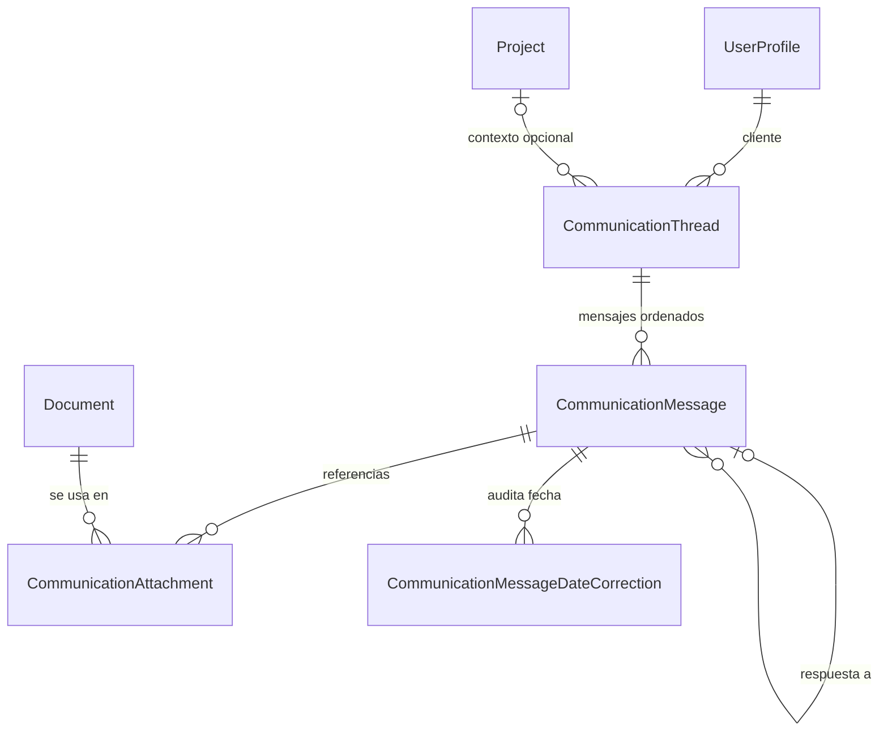

# Registro de comunicaciones con clientes — decisión y alcance vigente

Fecha: 2026-08-25

Estado: Implementado
Dependencias de producto: PA-58, PA-71, PA-108
PA-89: Resuelto por esta decisión; Comunicaciones vive en su propio módulo

## Decisión

Las comunicaciones viven como un **módulo de producto propio**. En el backend
comparten el Django app `content` y reutilizan clientes, proyectos, documentos,
autenticación y componentes del panel, pero no son un subtipo de `Document`.

La razón determinante es el modelo: un documento es una pieza de contenido con
un ciclo editorial; una conversación es un hilo con varios eventos ordenados,
dos direcciones, canales y estados operativos. Forzar mensajes como documentos
volvería ambiguos los listados, filtros, carpetas y estados editoriales de
Documentos, y separar esos datos después exigiría una migración costosa.

## Criterios fijados antes de evaluar

| Criterio | Extender Documentos | Módulo propio reutilizando componentes |
|---|---|---|
| Reutilización | Alta al inicio, pero mezcla almacenamiento y navegación | Alta en clientes, proyectos, documentos, auth y UI; modelo específico |
| Duplicación | Baja al inicio | Acotada a API/store/página del dominio |
| Encaje de un hilo | Débil: un `Document` no representa una secuencia bidireccional | Natural: hilo 1→N mensajes ordenados |
| Legibilidad de listados/filtros | Se degradan al mezclar piezas editoriales y conversaciones | Cada módulo conserva su vocabulario y filtros |
| Costo de separar después | Alto: migración de contenido, estados, URLs y referencias | Bajo: los límites ya existen |
| Reutilización de notas privadas | Sirven como textos auxiliares, no como historial enviado/recibido | Se mantienen independientes; cualquier reutilización necesita un requerimiento propio |

## Modelo materializado

- Un cliente puede tener varios hilos abiertos al mismo tiempo.
- El cliente del hilo es evidencia histórica e inmutable después de crearlo.
- El proyecto es opcional y sólo contextualiza; si el proyecto cambia de
  cliente, el hilo conserva su cliente histórico y se desvincula del proyecto.
- Cada mensaje guarda canal (`email`/`whatsapp`), dirección
  (`outgoing`/`incoming`), fecha ocurrida, contenido, estado y origen.
- Los estados persistidos son `draft`, `sent`, `received` y `failed`.
  **Respondido** es un estado de lectura derivado: un saliente enviado que ya
  tiene una respuesta entrante válida. Así no se destruye el hecho original de
  que fue enviado.
- Un mensaje entregado no se edita: puede anularse con motivo o corregirse su
  fecha mediante un evento append-only. Los borradores sí se editan/eliminan.
- Un adjunto no copia archivos. `CommunicationAttachment` referencia un
  `Document` existente; la API y la UI permiten navegar en ambas direcciones y
  bloquean borrar un documento aún referenciado.

## Alcance por canal

| Canal | Operación vigente | Límite del producto |
|---|---|---|
| WhatsApp | Copiar texto y registrar manualmente borrador/enviado/recibido | ProjectApp no infiere entrega ni recepción desde la acción de copiar |
| Correo | Registrar manualmente borrador/enviado/recibido | ProjectApp no afirma haber enviado el correo ni promete automatizarlo |

El registro manual resuelve la pérdida de constancia y es la forma de trabajo
elegida. Los campos técnicos `source` y `email_log` preservan compatibilidad con
hechos que otro sistema pudiera registrar, pero no constituyen una hoja de ruta
ni una promesa visible para el usuario.

## Alcance vigente

- Crear, consultar, filtrar, cerrar y reabrir hilos por cliente/proyecto.
- Navegar por proyectos o clientes con conteos que incluyen sus hilos y mantener
  los hilos sin proyecto accesibles mediante **Sin proyecto**.
- Buscar dentro de la navegación y ajustar su ancho en perfiles landscape; usar
  el drawer compartido en perfiles compactos.
- Combinar varios valores de estado, canal, dirección y estado de mensaje con OR
  dentro de una dimensión y AND entre dimensiones.
- Guardar con nombre el corte de navegación y filtros mediante el mecanismo de
  vistas contables, y restaurarlo desde cualquier visita.
- Abrir el hilo en un modal de trabajo direccionable desde la URL sin perder el
  contexto de la lista.
- Registrar entrantes y salientes, guardar borradores y marcar envío manual.
- Mostrar Enviado/Respondido sin confundirlos.
- Referenciar documentos existentes y consultar el uso inverso.
- Anular mensajes y corregir fechas con motivo auditado.
- Integrar accesos desde Clientes, Proyectos y Documentos.
- Incluir datos demo, API tests, store tests y flujo E2E registrado.

Decisiones cerradas: módulo propio; registro manual; cliente obligatorio;
proyecto opcional; documentos referenciados; mensajes entregados inmutables.

## Cambios posteriores no comprometidos

Plantillas, importaciones históricas, reportes adicionales o integraciones con
proveedores no forman una secuencia aprobada. Si el negocio los solicita, cada
uno requiere una ficha independiente que defina alcance, permisos, trazabilidad,
retención, idempotencia y experiencia de error sin cambiar retroactivamente el
significado del registro manual.

## Fuera del alcance vigente

- Envío real de correo o WhatsApp.
- Sincronización automática de respuestas.
- Plantillas y automatizaciones.
- Convertir `Document.client_custom_notes` en conversaciones.
- Borrar historial como efecto secundario de borrar clientes, proyectos o
  documentos.
